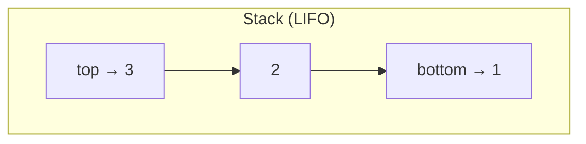
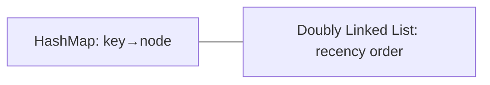

# 02 — DSA Part 1 (Arrays, Strings, Stack, Queue, Linked List) · Deep-Dive (20 Questions)

> **Bilingual:** English question + terms, Bengali explanation। সহজ → senior stretch।
> Pairs with `../02-dsa-part1.md`. Coding drill + MCQ দুটোর জন্যই।

---

### ১. Array কী এবং কোন operation-এর complexity কত?

**Description:** Array হলো contiguous fixed-size memory block, index দিয়ে O(1) access।

**মনে রাখার পয়েন্ট:**
- Access O(1), Search O(n), middle insert/delete O(n) (shifting লাগে)।
- End-এ insert O(1) amortized (dynamic array)।
- ব্যবহার: index access দরকার, size মোটামুটি জানা।

---

### ২. String কেন immutable এবং loop-এ concat কেন খারাপ?

**Description:** বেশিরভাগ ভাষায় (Java/Python/JS) string immutable — বদলালে নতুন object তৈরি হয়।

**মনে রাখার পয়েন্ট:**
- Loop-এ `s += x` প্রতিবার নতুন string → O(n²)।
- সমাধান: `StringBuilder` (Java) / list + `join` (Python)।
- Immutable-এর সুবিধা: thread-safe, hashable (map key হতে পারে)।

---

### ৩. Stack কী? LIFO কোথায় ব্যবহার হয়?

**Description:** Stack = **LIFO** (Last In First Out), এক প্রান্ত (top) দিয়ে push/pop, দুটোই O(1)।



**মনে রাখার পয়েন্ট:**
- ব্যবহার: undo/redo, function call stack, **balanced brackets**, DFS, expression eval, reverse।
- push/pop/peek — সব O(1)।
- MCQ: Stack ↔ LIFO — কখনো ভুল কোরো না।

---

### ৪. Queue কী? FIFO কোথায় ব্যবহার হয়?

**Description:** Queue = **FIFO** (First In First Out), rear-এ enqueue, front-এ dequeue।

**মনে রাখার পয়েন্ট:**
- ব্যবহার: **BFS**, task/print scheduling, buffering, order processing।
- Variants: circular queue, deque (দুই প্রান্ত), priority queue (heap)।
- MCQ: Queue ↔ FIFO, BFS-এ queue লাগে।

---

### ৫. Linked List vs Array — কখন কোনটা?

**Description:** Linked list = node (value + next pointer)। index access নেই কিন্তু insert/delete সস্তা।

**মনে রাখার পয়েন্ট:**
- Linked list: access/search O(n), known node-এ insert/delete O(1) (shift নেই)।
- Array: access O(1), কিন্তু middle insert/delete O(n)।
- Linked list বেছে নাও: ঘন ঘন insert/delete, size অজানা। Array: random access দরকার।

---

### ৬. Singly vs Doubly vs Circular Linked List?

**Description:** Linked list-এর তিন রূপ।

**মনে রাখার পয়েন্ট:**
- **Singly**: শুধু `next` — এক দিকে চলা।
- **Doubly**: `prev` + `next` — দুই দিকে (LRU cache-এ ব্যবহার)।
- **Circular**: tail → head — round-robin scheduling।

---

### ৭. Reverse a string using a Stack — কোড + complexity?

**Description:** Char গুলো stack-এ push করে pop করলে উল্টো order পাওয়া যায় (LIFO)।

```python
def reverse(s):
    stack = list(s)          # push all
    out = ""
    while stack:
        out += stack.pop()   # LIFO → reversed
    return out
# reverse("abc") -> "cba"  | Time O(n), Space O(n)
```

**মনে রাখার পয়েন্ট:**
- Stack LIFO তাই শেষ char আগে বেরোয় → reversed।
- Time O(n), Space O(n)। In-place two-pointer করলে Space O(1)।

---

### ৮. Detect a cycle in a linked list — Floyd's algorithm?

**Description:** দুই pointer — slow (+1), fast (+2)। cycle থাকলে ওরা মিলবে।

```python
def has_cycle(head):
    slow = fast = head
    while fast and fast.next:
        slow = slow.next
        fast = fast.next.next
        if slow == fast: return True
    return False
# Time O(n), Space O(1)
```

**মনে রাখার পয়েন্ট:**
- Floyd's "tortoise and hare" — **O(1) space** (hash set লাগে না)।
- fast ও slow মিললে cycle আছে।
- Cycle-এর start খুঁজতে: meet-এর পর একটা pointer head-এ ফিরিয়ে দুটো +1 করে চালাও।

---

### ৯. Valid Parentheses (balanced brackets) — কেন stack?

**Description:** `()[]{}` balanced কিনা — open bracket stack-এ push, close এলে top-এর সাথে match।

```python
def is_valid(s):
    pairs = {')':'(', ']':'[', '}':'{'}
    stack = []
    for c in s:
        if c in '([{': stack.append(c)
        elif not stack or stack.pop() != pairs[c]:
            return False
    return not stack
# Time O(n), Space O(n)
```

**মনে রাখার পয়েন্ট:**
- সর্বশেষ খোলা bracket সবার আগে বন্ধ হয় → LIFO → stack perfect।
- শেষে stack খালি হতে হবে (সব matched)।
- WellDev-এ reported problem।

---

### ১০. Two Sum — Hash Map কীভাবে O(n) করে?

**Description:** array-তে দুটো সংখ্যা যাদের যোগ target — hash map-এ complement খোঁজা।

```python
def two_sum(nums, target):
    seen = {}
    for i, x in enumerate(nums):
        if target - x in seen:
            return [seen[target-x], i]
        seen[x] = i
# Time O(n), Space O(n)
```

**মনে রাখার পয়েন্ট:**
- Brute force O(n²) (nested loop); hash map lookup O(1) → O(n)।
- complement (`target - x`) map-এ আছে কিনা দেখো।
- Space-time trade-off-এর ক্লাসিক উদাহরণ।

---

### ১১. Stack দিয়ে কীভাবে Queue বানাবে?

**Description:** দুটো stack — একটা enqueue, একটা dequeue।

**মনে রাখার পয়েন্ট:**
- `in` stack-এ push; dequeue-তে `out` খালি হলে সব `in` থেকে `out`-এ ঢালো।
- Amortized O(1) per operation।
- Interview favorite — LIFO দিয়ে FIFO simulate।

---

### ১২. Array-তে duplicate খোঁজা — কয়টা উপায়?

**Description:** তিন approach, ভিন্ন trade-off।

**মনে রাখার পয়েন্ট:**
- Brute force: nested loop O(n²), space O(1)।
- Sort করে পাশাপাশি check: O(n log n), space O(1)।
- Hash set: O(n) time, O(n) space (best time)।
- MCQ trap: "fastest" চাইলে hash set; "no extra space" চাইলে sort।

---

### ১৩. Amortized complexity মানে কী? (dynamic array)

**Description:** মাঝে মাঝে expensive operation হলেও গড়ে সস্তা।

**মনে রাখার পয়েন্ট:**
- Dynamic array full হলে double করে copy করে (O(n)), কিন্তু বেশিরভাগ append O(1)।
- গড়ে (amortized) append = O(1)।
- "Worst single op O(n) কিন্তু amortized O(1)" — এটাই মূল ধারণা।

---

### ১৪. Sliding Window pattern কী? কখন লাগে?

**Description:** contiguous subarray/substring-এর ওপর window সরিয়ে O(n)-এ কাজ করা।

```python
# Longest substring without repeating chars
def longest(s):
    seen, left, best = {}, 0, 0
    for right, c in enumerate(s):
        if c in seen and seen[c] >= left:
            left = seen[c] + 1
        seen[c] = right
        best = max(best, right - left + 1)
    return best
# Time O(n)
```

**মনে রাখার পয়েন্ট:**
- Nested loop O(n²) কে O(n)-এ নামায়।
- Window বাড়াও (right++), শর্ত ভাঙলে সংকোচ (left++)।
- ব্যবহার: longest/shortest substring, max sum subarray of size k।

---

### ১৫. Two-pointer technique — কোথায়?

**Description:** দুই index দুই দিক থেকে বা একই দিকে চালিয়ে O(n)।

**মনে রাখার পয়েন্ট:**
- Sorted array-তে pair sum, palindrome check, reverse in-place।
- Space O(1) — extra structure লাগে না।
- Sliding window-ও two-pointer-এর একটা রূপ।

---

### ১৬. Hash map collision কীভাবে সামলানো হয়?

**Description:** দুই key একই bucket-এ পড়লে collision — chaining বা open addressing।

**মনে রাখার পয়েন্ট:**
- **Chaining**: প্রতি bucket-এ linked list।
- **Open addressing**: পরের খালি slot খোঁজা (probing)।
- Collision বাড়লে lookup O(1) → worst O(n)।
- Load factor বাড়লে resize (rehash)।

---

### ১৭. Priority Queue / Heap কী?

**Description:** সবচেয়ে ছোট/বড় element দ্রুত পাওয়া যায় এমন structure (binary heap দিয়ে)।

**মনে রাখার পয়েন্ট:**
- Insert O(log n), min/max peek O(1), extract O(log n)।
- ব্যবহার: Dijkstra, top-K element, task scheduling by priority।
- Min-heap: root সবচেয়ে ছোট; Max-heap: root সবচেয়ে বড়।

---

### ১৮. Deque কী এবং কেন দরকার?

**Description:** Double-ended queue — দুই প্রান্ত থেকেই O(1) insert/delete।

**মনে রাখার পয়েন্ট:**
- front + rear দুই দিকেই push/pop।
- ব্যবহার: sliding window maximum, palindrome check, undo history।
- Stack + Queue দুটোরই কাজ করতে পারে।

---

### ১৯. [Stretch] LRU Cache কোন structures দিয়ে বানায়?

**Description:** Least Recently Used cache — O(1) get/put দরকার।



**মনে রাখার পয়েন্ট:**
- **HashMap + Doubly Linked List** — map O(1) lookup, DLL O(1) reorder।
- access করলে node-কে front-এ সরাও; full হলে tail (LRU) সরাও।
- Interview classic — কোন structure combo জানলেই অর্ধেক জেতা।

---

### ২০. [Stretch] In-place string reverse — Space O(1) কীভাবে?

**Description:** Stack ছাড়া, two-pointer swap দিয়ে extra space ছাড়া reverse।

```python
def reverse_inplace(chars):   # list of chars
    l, r = 0, len(chars) - 1
    while l < r:
        chars[l], chars[r] = chars[r], chars[l]
        l += 1; r -= 1
    return chars
# Time O(n), Space O(1)
```

**মনে রাখার পয়েন্ট:**
- Stack approach Space O(n); two-pointer Space O(1) — interviewer এই optimization চায়।
- immutable string-এ (Python str) সরাসরি হয় না → list বানাতে হয়।
- "can you do it without extra space?" — উত্তর: two-pointer।

---

## Quick self-check
১-৬: structures ও complexity। ৭-১০: reverse-stack, cycle, brackets, two-sum (reported problems)। ১১-১৮: stack-from-queue, duplicates, amortized, sliding window, two-pointer, collision, heap, deque। ১৯-২০: LRU cache, in-place reverse (stretch)।
