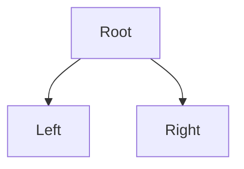
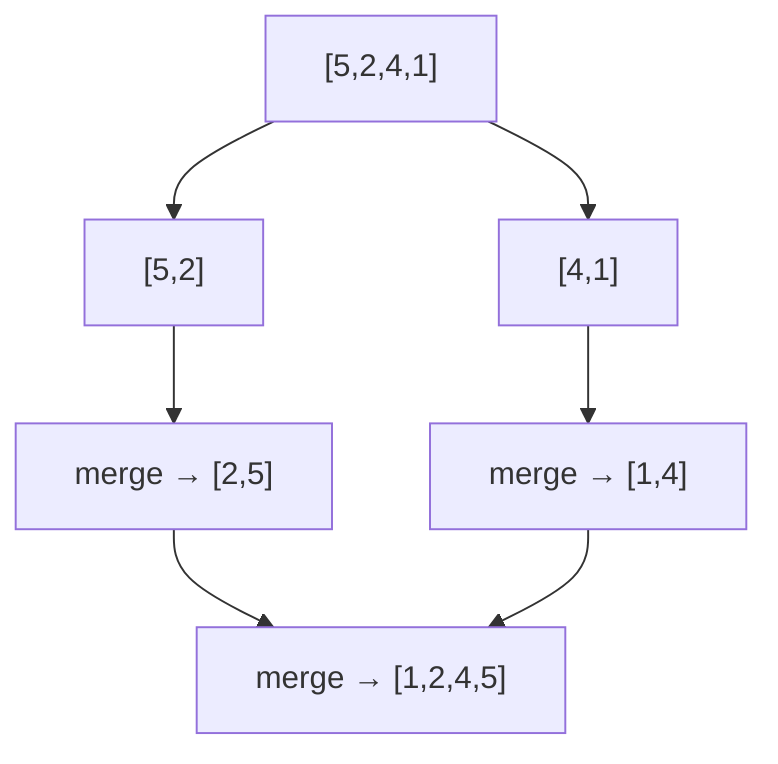

# 03 — DSA Part 2 (Trees, Hashing, Recursion) + Complexity · Deep-Dive (20 Questions)

> **Bilingual:** English question + terms, Bengali explanation। সহজ → senior stretch।
> Pairs with `../03-dsa-part2-complexity.md`. Big-O + coding drill।

---

### ১. Big-O notation মানে কী এবং কেন লাগে?

**Description:** Input বাড়লে algorithm কত দ্রুত/ধীর হয় তার upper bound — hardware-স্বাধীন measure।

**মনে রাখার পয়েন্ট:**
- ক্রম: O(1) < O(log n) < O(n) < O(n log n) < O(n²) < O(2ⁿ) < O(n!)।
- Constant ও lower term বাদ: O(2n+5) → O(n); O(n²+n) → O(n²)।
- Big-O = worst case upper bound (সবচেয়ে বেশি cited)।

---

### ২. একটা code snippet-এর Big-O কীভাবে বের করবে?

**Description:** Loop structure দেখে দ্রুত নির্ণয় করার নিয়ম।

**মনে রাখার পয়েন্ট:**
- একটা loop over n → O(n)।
- Loop-এর ভেতর loop (দুটোই n) → O(n²)।
- প্রতি step-এ অর্ধেক (`i *= 2`) → O(log n)।
- দুটো আলাদা loop → O(n) + O(n) = O(n)।
- Split-in-half + combine (merge sort) → O(n log n)।

---

### ৩. Time vs Space complexity — trade-off?

**Description:** দ্রুত করতে গেলে প্রায়ই বেশি memory লাগে, উল্টোটাও।

**মনে রাখার পয়েন্ট:**
- Hash map two-sum: Time O(n), Space O(n)। Brute force: Time O(n²), Space O(1)।
- Space complexity = extra memory (input বাদে)।
- Recursion-এ call stack Space O(depth)।

---

### ৪. Binary Search কেন O(log n)?

**Description:** Sorted array-তে প্রতিবার অর্ধেক বাদ দেয়।

```python
def binary_search(a, target):
    lo, hi = 0, len(a)-1
    while lo <= hi:
        mid = (lo+hi)//2
        if a[mid] == target: return mid
        elif a[mid] < target: lo = mid+1
        else: hi = mid-1
    return -1
# Time O(log n)
```

**মনে রাখার পয়েন্ট:**
- প্রতি step-এ search space অর্ধেক → log₂(n) step।
- **শর্ত: array sorted হতে হবে**।
- MCQ: binary search = O(log n) — instant উত্তর।

---

### ৫. Tree traversals — In/Pre/Post-order কী দেয়?

**Description:** DFS-এর তিন রূপ, root কখন visit হয় তার ওপর নাম।



**মনে রাখার পয়েন্ট:**
- **In-order** (Left, Root, Right) → BST-তে **sorted** output।
- **Pre-order** (Root, Left, Right) → tree copy/serialize।
- **Post-order** (Left, Right, Root) → tree delete / expression eval।
- MCQ trap: "sorted order" চাইলে In-order।

---

### ৬. BFS vs DFS — কোনটা কোন structure?

**Description:** Graph/tree traversal-এর দুই মূল কৌশল।

**মনে রাখার পয়েন্ট:**
- **BFS** = queue, level-by-level (shortest path unweighted)।
- **DFS** = stack/recursion, deep first (cycle detection, topological sort)।
- BFS space O(width), DFS space O(height)।
- MCQ: BFS ↔ queue, DFS ↔ stack।

---

### ৭. Binary Search Tree (BST) — complexity কখন ভাঙে?

**Description:** BST-তে left < node < right, তাই search O(log n) — কিন্তু শুধু balanced হলে।

**মনে রাখার পয়েন্ট:**
- Balanced BST: search/insert/delete O(log n)।
- Skewed (একদিকে হেলে) BST → O(n) (linked list-এর মতো)।
- সমাধান: self-balancing (AVL, Red-Black tree)।

---

### ৮. Hash Map কেন average O(1)?

**Description:** hash function key → bucket সরাসরি নিয়ে যায়, index-এর মতো।

**মনে রাখার পয়েন্ট:**
- Average lookup/insert/delete O(1)।
- Worst O(n) — সব key একই bucket-এ (collision)।
- ব্যবহার: frequency count, dedup, caching, two-sum।

---

### ৯. Recursion-এর দুই অপরিহার্য অংশ?

**Description:** প্রতিটা recursion-এ base case + recursive case লাগে।

**মনে রাখার পয়েন্ট:**
- **Base case** — থামার শর্ত (না থাকলে infinite → stack overflow)।
- **Recursive case** — নিজেকে ছোট input-এ call।
- Call stack ব্যবহার করে → Space O(depth)।

---

### ১০. Fibonacci — recursive কেন O(2ⁿ), iterative কেন ভালো?

**Description:** Naive recursion একই subproblem বারবার হিসাব করে।

```python
def fib(n):                       # O(2^n) — slow
    if n < 2: return n
    return fib(n-1) + fib(n-2)

def fib_fast(n):                  # O(n), Space O(1)
    a, b = 0, 1
    for _ in range(n): a, b = b, a+b
    return a
```

**মনে রাখার পয়েন্ট:**
- Naive recursive fib = O(2ⁿ) (exponential branching)।
- Iterative / memoization = O(n)।
- Memoization (top-down DP) দিয়ে recursion-ও O(n) করা যায়।

---

### ১১. Memoization vs Tabulation (DP)?

**Description:** Dynamic Programming-এর দুই ধরন — overlapping subproblem cache করা।

**মনে রাখার পয়েন্ট:**
- **Memoization** = top-down, recursion + cache।
- **Tabulation** = bottom-up, iterative table পূরণ।
- দুটোই O(n) fib-এ; DP লাগে overlapping subproblem + optimal substructure থাকলে।

---

### ১২. Recursive reverse a number — কোড?

**Description:** সংখ্যার digit উল্টানো recursion দিয়ে।

```python
def reverse_num(n, rev=0):
    if n == 0: return rev
    return reverse_num(n//10, rev*10 + n%10)
# reverse_num(123) -> 321
```

**মনে রাখার পয়েন্ট:**
- `n % 10` শেষ digit, `n // 10` বাকি অংশ।
- rev-এ digit জমতে থাকে → base case n==0।
- WellDev reported problem।

---

### ১৩. Sorting algorithms — কোনটার complexity কত?

**Description:** MCQ-তে সবচেয়ে বেশি আসা comparison।

| Sort | Avg | Worst | Space | Stable |
|------|-----|-------|-------|--------|
| Bubble | O(n²) | O(n²) | O(1) | Yes |
| Insertion | O(n²) | O(n²) | O(1) | Yes |
| Merge | O(n log n) | O(n log n) | O(n) | Yes |
| Quick | O(n log n) | O(n²) | O(log n) | No |
| Heap | O(n log n) | O(n log n) | O(1) | No |

**মনে রাখার পয়েন্ট:**
- Merge sort সবসময় O(n log n) কিন্তু Space O(n)।
- Quick sort avg O(n log n), worst O(n²) (bad pivot / sorted input)।
- "Stable + guaranteed n log n" = Merge sort।

---

### ১৪. Merge Sort কীভাবে কাজ করে?

**Description:** Divide and conquer — অর্ধেক ভাগ করে sort করে merge।



**মনে রাখার পয়েন্ট:**
- Split O(log n) level × merge O(n) = O(n log n)।
- Stable, কিন্তু O(n) extra space।
- WellDev-এ "implement merge sort" reported।

---

### ১৫. Quick Sort — pivot কেন গুরুত্বপূর্ণ?

**Description:** একটা pivot বেছে ছোট/বড় ভাগ করে recursively sort।

**মনে রাখার পয়েন্ট:**
- Good pivot → balanced split → O(n log n)।
- Bad pivot (sorted array-তে first element) → O(n²)।
- সমাধান: random pivot / median-of-three।
- In-place (Space O(log n)) কিন্তু unstable।

---

### ১৬. Greedy vs Dynamic Programming — পার্থক্য?

**Description:** দুটোই optimization, কিন্তু সিদ্ধান্ত নেওয়ার ধরন আলাদা।

**মনে রাখার পয়েন্ট:**
- **Greedy**: প্রতি step-এ locally best বেছে নেয় (Dijkstra, coin change canonical)।
- **DP**: সব subproblem হিসাব করে globally optimal (0/1 knapsack)।
- Greedy দ্রুত কিন্তু সবসময় optimal নয়; DP নিশ্চিত কিন্তু ধীর।

---

### ১৭. Coin Change (greedy) — কীভাবে?

**Description:** নির্দিষ্ট amount বানাতে ন্যূনতম coin — canonical system-এ greedy কাজ করে।

```python
def coin_change_greedy(coins, amount):
    coins.sort(reverse=True)
    count = 0
    for c in coins:
        count += amount // c
        amount %= c
    return count if amount == 0 else -1
```

**মনে রাখার পয়েন্ট:**
- বড় coin আগে নাও → count কম।
- সতর্কতা: arbitrary coin set-এ greedy fail করতে পারে → তখন DP লাগে।
- WellDev reported problem।

---

### ১৮. Hash map দিয়ে duplicate/frequency — কোড?

**Description:** এক pass-এ count বা duplicate বের করা।

```python
def find_dupes(arr):
    seen, dupes = set(), []
    for x in arr:
        if x in seen: dupes.append(x)
        else: seen.add(x)
    return dupes
# Time O(n), Space O(n)
```

**মনে রাখার পয়েন্ট:**
- Set/map lookup O(1) → total O(n)。
- Frequency-র জন্য `dict` / `Counter` ব্যবহার।
- Space-time trade-off (O(n) space)।

---

### ১৯. [Stretch] Recursion কখন O(n²) space নয় বরং stack overflow করে?

**Description:** গভীর recursion call stack ভরে দেয়।

**মনে রাখার পয়েন্ট:**
- প্রতি recursive call stack frame নেয় → depth n হলে Space O(n)।
- Deep recursion (n=10⁶) → stack overflow।
- সমাধান: iterative রূপে রূপান্তর, বা tail-call (কিছু ভাষায়)।

---

### ২০. [Stretch] O(n log n)-এর নিচে sort সম্ভব? (comparison sort lower bound)

**Description:** Comparison-based sort-এর তাত্ত্বিক সীমা O(n log n); কিছু non-comparison sort দ্রুততর।

**মনে রাখার পয়েন্ট:**
- Comparison sort lower bound = O(n log n) (তুলনা করে sort করলে এর নিচে নামা যায় না)।
- **Counting sort / Radix sort** = O(n+k) — কিন্তু integer/limited range-এ।
- Interview line: "range ছোট হলে counting sort O(n), নইলে merge/quick sort"।

---

## Quick self-check
১-৩: Big-O basics ও trade-off। ৪-১০: binary search, tree traversal, BFS/DFS, BST, hashing, recursion, fibonacci। ১১-১৮: DP, reverse-num, sorting table, merge/quick sort, greedy vs DP, coin change, duplicates। ১৯-২০: recursion depth, sort lower bound (stretch)।
