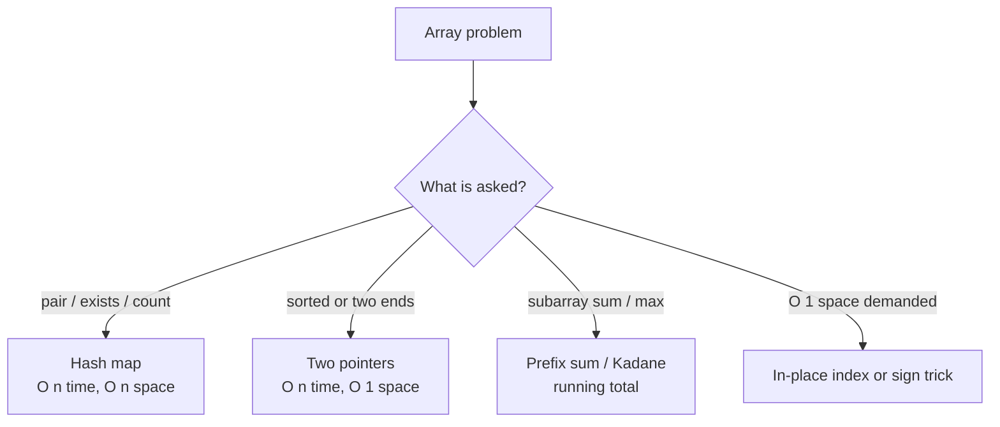

# 01 — Arrays (25)

> Graded problems for this pattern live in `easy.md`, `medium.md`, and `hard.md` in this same folder.

> **Goal:** recognize the 4 array workhorses instantly — **hash-map lookup**, **two pointers**, **prefix/running state**, **in-place index tricks** — and reach for the right one from the problem's shape.

---

## The Pattern

Arrays are the default container, so "array problems" are really *technique* problems. The tell is in the ask:

- "find a pair / does X exist" → **hash map** (trade space for O(1) lookup).
- "sorted array" or "pair from two ends" → **two pointers**.
- "subarray sum / running total" → **prefix sum** or **Kadane's** running state.
- "do it in O(1) extra space" → **in-place**: use the array's own indices/signs as storage.

Core idea across all four: **one pass, remember just enough** so you never re-scan.

## Diagram



## Reusable PHP Templates

```php
// 1) Hash-map "seen" pass — pair / duplicate / complement
function scan(array $a) {
    $seen = [];                     // value => index
    foreach ($a as $i => $x) {
        if (isset($seen[$target - $x])) return [$seen[$target - $x], $i];
        $seen[$x] = $i;
    }
    return [];
}

// 2) Two pointers from both ends (array must be sorted)
$l = 0; $r = count($a) - 1;
while ($l < $r) {
    $sum = $a[$l] + $a[$r];
    if ($sum === $target) { /* hit */ break; }
    $sum < $target ? $l++ : $r--;
}

// 3) Running state (Kadane / prefix)
$best = $cur = $a[0];
for ($i = 1; $i < count($a); $i++) {
    $cur = max($a[$i], $cur + $a[$i]);   // extend or restart
    $best = max($best, $cur);
}
```

## Big-O Cheat Table

| Approach | Time | Space | Use when |
|----------|------|-------|----------|
| Brute force nested loop | O(n²) | O(1) | last resort / tiny n |
| Hash map lookup | O(n) | O(n) | "find pair / duplicate / complement" |
| Two pointers | O(n) | O(1) | sorted array / pair from ends |
| Sort then scan | O(n log n) | O(1)* | order helps (3Sum, intervals) |
| Prefix sum | O(n) | O(n) | range/subarray sums |
| Kadane's | O(n) | O(1) | max subarray |

---

## Common Traps / Interview Tips

- **Off-by-one in two-pointer loops** — decide `<` vs `<=` by asking "can `l` and `r` be the same element?"
- **Forgetting to skip duplicates** in 3Sum / sorted problems → duplicate answers.
- **Kadane's** with all-negative input: initialize `best` to `nums[0]`, *not* `0`.
- **Integer overflow** on products (LC 152/238) — mention it even if PHP auto-promotes to float.
- **In-place** answers score points — always ask "can I avoid the extra array?"
- State the **space** win out loud: two pointers turn an O(n) hash-map solution into O(1) space.
