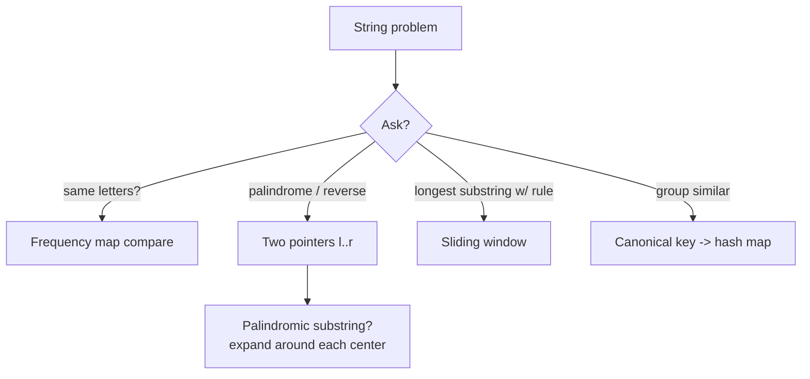

# 02 — Strings (20)

> Graded problems for this pattern live in `easy.md`, `medium.md`, and `hard.md` in this same folder.

> **Goal:** treat strings as char arrays + a frequency map. Master **char-count comparison**, **two-pointer palindrome**, and **expand-around-center**, and most string questions fall.

---

## The Pattern

Strings are immutable in most languages, so the trick is **what you count or track** while scanning:

- "anagram / same letters / permutation" → **frequency map** (26-int array or assoc array).
- "palindrome / reverse" → **two pointers** from both ends (or expand from center).
- "longest substring with a rule" → **sliding window** (see two-pointers-sliding-window pattern).
- "group by signature" → build a **canonical key** (sorted chars / count string) → hash map.

Golden rule: **never concatenate in a loop** (O(n²)) — push to an array and `implode()`.

## Diagram



## Reusable PHP Templates

```php
// Frequency map (assoc) — anagram / counting
function freq(string $s): array {
    $m = [];
    for ($i = 0; $i < strlen($s); $i++) $m[$s[$i]] = ($m[$s[$i]] ?? 0) + 1;
    return $m;
}

// Two-pointer palindrome check
function isPalin(string $s): bool {
    $l = 0; $r = strlen($s) - 1;
    while ($l < $r) if ($s[$l++] !== $s[$r--]) return false;
    return true;
}

// Expand around center (odd + even) — longest palindromic substring
function expand(string $s, int $l, int $r): int {
    $n = strlen($s);
    while ($l >= 0 && $r < $n && $s[$l] === $s[$r]) { $l--; $r++; }
    return $r - $l - 1;                 // length of the palindrome
}
```

## Big-O Cheat Table

| Task | Approach | Time | Space |
|------|----------|------|-------|
| Anagram check | count map / sort | O(n) / O(n log n) | O(1) (26) |
| Palindrome check | two pointers | O(n) | O(1) |
| Longest palindromic substring | expand around center | O(n²) | O(1) |
| Group anagrams | sorted-key map | O(n·k log k) | O(n·k) |
| Longest substring no-repeat | sliding window | O(n) | O(min(n,alphabet)) |

---

## Common Traps / Interview Tips

- **Concatenation in a loop is O(n²)** — collect into an array + `implode()`.
- **Anagram length check first** — different lengths → instant `false`, cheap early exit.
- **Palindrome center count is 2n-1** — every index (odd) *and* every gap (even). Forgetting even centers misses "abba".
- **Unicode vs bytes** — `strlen` counts bytes; mention `mb_strlen` if the interviewer raises multibyte.
- **atoi / Roman** are *rule-transcription* problems — write the rules as a table first, then code.
- Say the complexity of your **key-building** step (sorting chars is O(k log k) per word).
