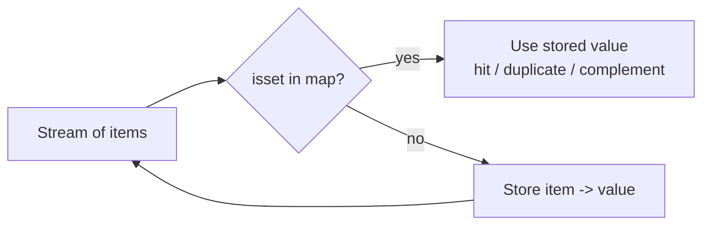

# 03 — Hashing / Maps & Sets (12)

> Graded problems for this pattern live in `easy.md`, `medium.md`, and `hard.md` in this same folder.

> **Goal:** trade space for O(1) lookups. When a problem says "have I seen this?", "how many of X?", or "does the complement exist?", the answer is a **hash map or set**.

---

## The Pattern

A hash map turns an O(n) search into O(1). Three shapes cover almost everything:

1. **Set of seen values** — membership / duplicate detection. `isset($seen[$x])`.
2. **Count map** — frequency of each key (anagrams, top-K, majority).
3. **Complement / index map** — "does `target - x` exist?" (Two Sum family).

The tell: any time your brute force is "for each element, look at every other element" — a hash map usually collapses the inner loop.

## Diagram



## Reusable PHP Templates

```php
// Seen-set (dedupe / cycle-free membership)
$seen = [];
foreach ($items as $x) {
    if (isset($seen[$x])) { /* duplicate */ }
    $seen[$x] = true;
}

// Count map + sort by frequency (top-K)
$count = array_count_values($nums);      // value => frequency, built-in
arsort($count);                          // highest frequency first
$topK = array_slice(array_keys($count), 0, $k);
```

> ⚠️ PHP note: `array_count_values` only counts int/string values. For objects or
> mixed keys, build the map manually with `($m[$k] ?? 0) + 1`.

## Big-O Cheat Table

| Operation | Hash map | Sorted array | Notes |
|-----------|:--------:|:------------:|-------|
| Insert | O(1) avg | O(n) | |
| Lookup / contains | O(1) avg | O(log n) | map wins for point queries |
| Count frequencies | O(n) | O(n log n) | `array_count_values` |
| Top-K frequent | O(n log k) | — | heap or sort the count map |

---

## Common Traps / Interview Tips

- **PHP array keys coerce** — `"1"` and `1` collide, floats truncate to int keys. If keys must stay distinct, prefix them (`"i:".$x`) or use `SplObjectStorage`.
- **Set = `array_flip`** for O(1) contains; don't `in_array` in a loop (that's O(n) each → O(n²)).
- **Longest Consecutive**: the "only start from `x-1` missing" check is what makes it O(n); without it you re-walk runs → O(n²).
- **Subarray Sum Equals K** is prefix-sum + map, *not* sliding window (negatives break the window).
- Always state the **space cost** — hashing buys speed by spending memory; the interviewer wants you to name the trade.
