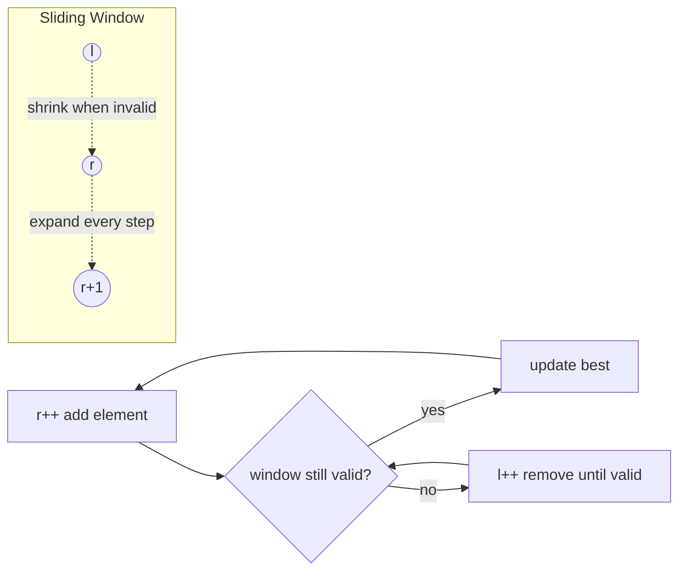

# 04 — Two Pointers & Sliding Window (15)

> Graded problems for this pattern live in `easy.md`, `medium.md`, and `hard.md` in this same folder.

> **Goal:** turn nested-loop O(n²) scans into a single O(n) pass by moving two indices smartly — **converging pointers** (sorted pairs) and the **sliding window** (contiguous subarray/substring under a rule).

---

## The Pattern

**Two pointers** and **sliding window** are the same idea — two indices `l` and `r` that never go backward, so the whole thing is O(n).

- **Converging** (`l` from start, `r` from end): sorted-array pairs, palindrome, container-with-water. Move the pointer that can improve the answer.
- **Sliding window** (both move right, `r` expands, `l` shrinks): "longest / shortest / max contiguous subarray or substring satisfying a rule". Grow `r`; when the window breaks the rule, shrink `l` until it's valid again.

The tell for a window: **"contiguous"** + **"subarray/substring"** + an optimize word (longest / shortest / max sum / at most K).

## Diagram



## Reusable PHP Templates

```php
// A) Converging pointers (array sorted)
$l = 0; $r = count($a) - 1;
while ($l < $r) {
    $val = $a[$l] + $a[$r];
    if ($val === $target) break;
    $val < $target ? $l++ : $r--;      // move the side that helps
}

// B) Variable-size sliding window (longest under a rule)
$l = 0; $best = 0; $win = [];          // window state (counts / sum)
for ($r = 0; $r < count($a); $r++) {
    // add $a[$r] to window state
    while (/* window invalid */) {
        // remove $a[$l] from window state
        $l++;
    }
    $best = max($best, $r - $l + 1);   // valid window size
}

// C) Fixed-size window of size k (running sum)
$sum = array_sum(array_slice($a, 0, $k)); $best = $sum;
for ($r = $k; $r < count($a); $r++) {
    $sum += $a[$r] - $a[$r - $k];      // slide: add new, drop old
    $best = max($best, $sum);
}
```

## Big-O Cheat Table

| Problem shape | Technique | Time | Space |
|---------------|-----------|------|-------|
| Pair in sorted array | converging pointers | O(n) | O(1) |
| Max/min contiguous window | variable window | O(n) | O(1)–O(k) |
| Fixed-size k window | slide sum | O(n) | O(1) |
| Window max (each window) | monotonic deque | O(n) | O(k) |

---

## Common Traps / Interview Tips

- **Which pointer moves?** Converging: move the one that *can* improve the result (shorter wall, smaller sum). Guessing wrong gives O(n²) or wrong answers.
- **Window invariant** — write down "the window is valid when ___" before coding the `while` shrink; that one line prevents most bugs.
- **Negatives kill fixed windows** — Min Subarray Sum works because values are positive. With negatives, use prefix-sum + map instead.
- **LC 239 must be O(n)** — a heap gives O(n log k); interviewers often want the **monotonic deque** O(n).
- **Off-by-one on window size:** valid window length is `r - l + 1`. Say it out loud.
