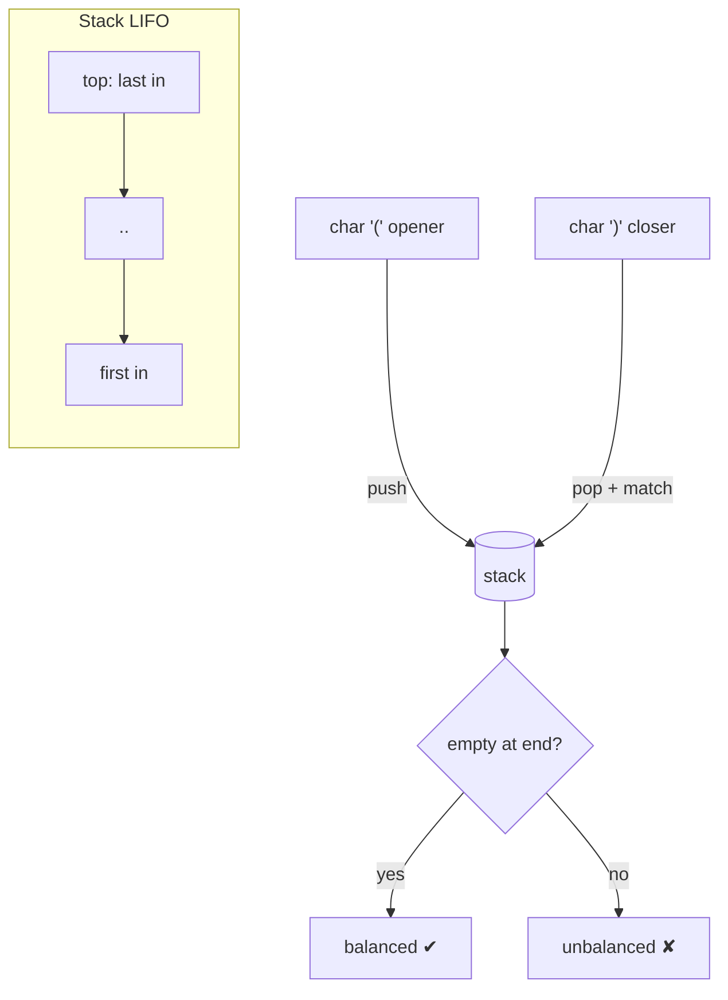

# 05 — Stack & Queue (15)

> Graded problems for this pattern live in `easy.md`, `medium.md`, and `hard.md` in this same folder.

> **Goal:** know LIFO vs FIFO cold, and recognize the two killer stack patterns — **matching/nesting** (brackets, decode) and the **monotonic stack** (next-greater, histogram).

---

## The Pattern

- **Stack (LIFO)** — "most recent unmatched thing". Tells: **brackets/parentheses**, undo, expression evaluation, reverse, DFS, "next greater/smaller element".
- **Queue (FIFO)** — "process in arrival order". Tells: BFS, scheduling, buffering.
- **Monotonic stack** — keep the stack sorted (increasing or decreasing) by popping violators. This solves "next greater element", "daily temperatures", "largest rectangle" in O(n).

The bracket tell: whenever you see **nested / balanced / matching pairs**, push openers, pop on closers, and the answer is "stack empty at the end?".

## Diagram



## Reusable PHP Templates

```php
// Stack via array: push = [], pop = array_pop, peek = end()
$stack = [];
$stack[] = $x;          // push
$top = end($stack);     // peek
$x = array_pop($stack); // pop

// Queue: enqueue = [], dequeue = array_shift (O(n)) — or SplQueue for O(1)
$q = new SplQueue();
$q->enqueue($x);
$x = $q->dequeue();

// Monotonic (decreasing) stack — next greater element
$stack = [];                          // holds indices
for ($i = 0; $i < $n; $i++) {
    while (!empty($stack) && $a[end($stack)] < $a[$i]) {
        $j = array_pop($stack);       // a[i] is next-greater for a[j]
        $res[$j] = $a[$i];
    }
    $stack[] = $i;
}
```

## Big-O Cheat Table

| Structure | Push/Enqueue | Pop/Dequeue | Peek |
|-----------|:-----------:|:-----------:|:----:|
| Stack (array) | O(1) | O(1) | O(1) |
| Queue (`SplQueue`) | O(1) | O(1) | O(1) |
| Queue (`array_shift`) | O(1) | **O(n)** ⚠️ | O(1) |
| Monotonic stack pass | — | — | overall **O(n)** |

---

## Common Traps / Interview Tips

- **`array_shift` is O(n)** — for a real queue use `SplQueue`/`SplDoublyLinkedList`, or two stacks. Interviewers notice.
- **Balanced brackets edge cases:** empty string (valid), a lone closer `)` (pop on empty → false), leftover openers at end (`!empty` → false).
- **Monotonic stack direction** — decreasing stack → next *greater*; increasing → next *smaller*. State which and why.
- **RPN division** truncates toward zero — use `intdiv`, not `/` (which gives a float).
- **Decode String / Basic Calculator** need *two* stacks (numbers + context) — draw the stack state on paper first.
