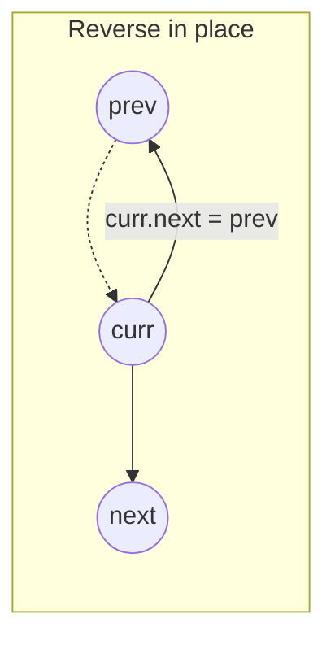
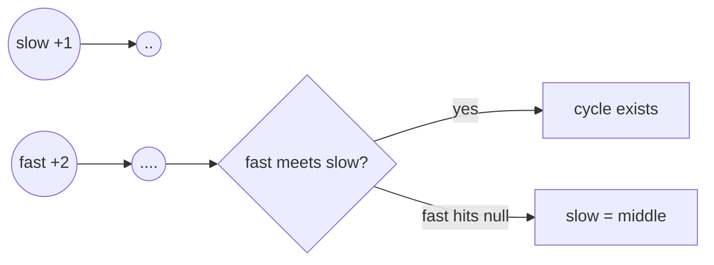

# 06 — Linked List (15)

> Graded problems for this pattern live in `easy.md`, `medium.md`, and `hard.md` in this same folder.

> **Goal:** master the three moves — **reverse by pointer-flipping**, **fast/slow pointers** (cycle, middle, nth-from-end), and the **dummy head** for clean insert/delete.

---

## The Pattern

A linked list has no indices — you only ever hold a **pointer** to a node and follow `->next`. Almost every problem is one of three moves:

- **Pointer flipping** — reverse a list by re-pointing each `next` backward. Keep `prev`, `curr`, `next`.
- **Fast & slow (Floyd)** — two pointers at different speeds. `slow` +1, `fast` +2 → they meet ⇒ **cycle**; when `fast` hits the end, `slow` is the **middle**. A gap of `n` finds the **nth-from-end**.
- **Dummy head** — a throwaway node before `head` so inserting/deleting the *first* node needs no special case. Return `dummy->next`.

The tell: "reverse", "middle", "cycle", "nth from end", "merge two sorted" → linked-list pointer choreography, O(1) space.

## Diagram





## Reusable PHP Templates

```php
// Node definition (LC style)
class ListNode {
    public $val; public $next;
    public function __construct($val = 0, $next = null) { $this->val = $val; $this->next = $next; }
}

// A) Reverse a list — pointer flipping
function reverse(?ListNode $head): ?ListNode {
    $prev = null;
    while ($head) {
        $next = $head->next;   // save
        $head->next = $prev;   // flip
        $prev = $head;         // advance prev
        $head = $next;         // advance curr
    }
    return $prev;              // new head
}

// B) Fast & slow pointers
$slow = $fast = $head;
while ($fast && $fast->next) { $slow = $slow->next; $fast = $fast->next->next; }
// slow is now the middle

// C) Dummy head for insert/delete
$dummy = new ListNode(0, $head);
$prev = $dummy;
// ... walk $prev, splice nodes ...
return $dummy->next;
```

## Big-O Cheat Table

| Task | Technique | Time | Space |
|------|-----------|------|-------|
| Reverse | pointer flip | O(n) | O(1) |
| Detect cycle | fast/slow | O(n) | O(1) |
| Find middle | fast/slow | O(n) | O(1) |
| Nth from end | two-pointer gap | O(n) | O(1) |
| Merge two sorted | dummy + splice | O(n+m) | O(1) |

---

## Common Traps / Interview Tips

- **Lost head** — save `head->next` *before* flipping `head->next`, or you drop the rest of the list.
- **`fast->next->next` null check** — guard `while ($fast && $fast->next)`, else you dereference null on even-length lists.
- **Dummy head** removes the "what if I delete the first node?" special case — use it for any insert/delete-at-head problem.
- **`===` not `==`** for node identity in cycle detection — you compare *the same object*, not equal values.
- **Even vs odd middle** — decide up front whether you want the first or second middle; the loop condition changes.
- **Draw it.** Two or three boxes with arrows on paper prevents 90% of pointer bugs.
