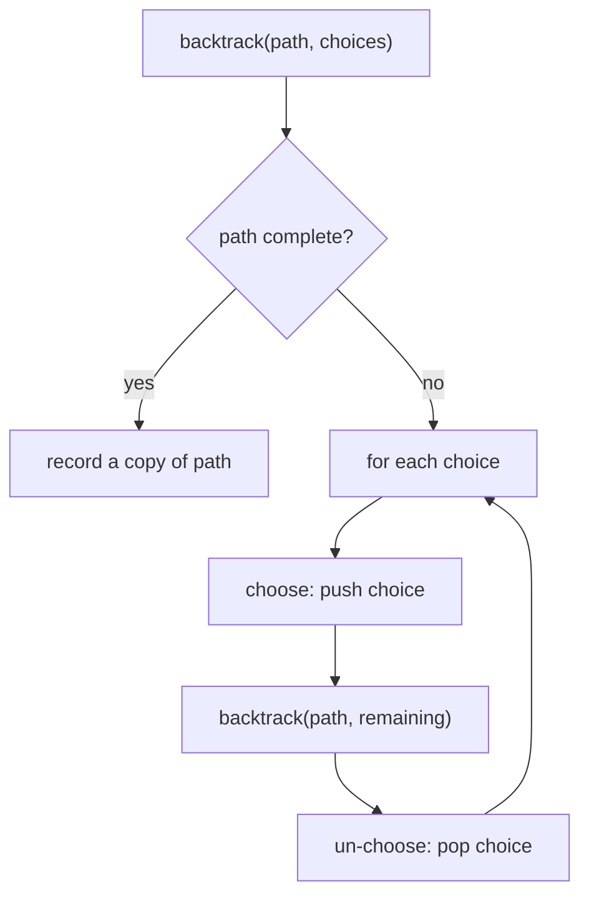

# 07 — Recursion & Backtracking (15)

> Graded problems for this pattern live in `easy.md`, `medium.md`, and `hard.md` in this same folder.

> **Goal:** write a recursion by naming the **base case** and the **shrink step**, then level up to **backtracking** — choose → recurse → *un-choose* — for subsets, permutations, and grid search.

---

## The Pattern

**Recursion** = solve a problem in terms of a smaller version of itself. Two lines to write first:

1. **Base case** — the smallest input you can answer without recursing (stops infinite descent).
2. **Recursive step** — reduce the problem (`n-1`, half the array, one char less) and combine.

**Backtracking** = recursion that *builds a candidate* and **undoes** its last choice before trying the next. The skeleton is always **choose → recurse → un-choose**. Use it for "all subsets / permutations / combinations / paths" — anything asking for *every* valid arrangement.

The tell: "generate all…", "how many ways…", "find a path/arrangement" → backtracking. "Reduce n / reverse / factorial / tree walk" → plain recursion.

## Diagram



## Reusable PHP Templates

```php
// A) Plain recursion — base case + shrink
function fact(int $n): int {
    if ($n <= 1) return 1;          // base case
    return $n * fact($n - 1);       // shrink toward base
}

// B) Backtracking skeleton — subsets / permutations
function backtrack(array $path, array $choices, array &$out): void {
    // (optional) if goal met: $out[] = $path; return;
    foreach ($choices as $i => $c) {
        $path[] = $c;                               // choose
        backtrack($path, /* reduced */ $choices, $out);
        array_pop($path);                           // un-choose
    }
}
```

## Big-O Cheat Table

| Problem | Recurrence | Time | Space (stack) |
|---------|-----------|------|---------------|
| Factorial / reverse number | T(n)=T(n-1)+O(1) | O(n) | O(n) |
| Fibonacci naive | T(n)=T(n-1)+T(n-2) | O(2ⁿ) | O(n) |
| Fibonacci memo/DP | — | O(n) | O(n)/O(1) |
| Subsets | 2 choices per element | O(n·2ⁿ) | O(n) |
| Permutations | n! arrangements | O(n·n!) | O(n) |
| Combination Sum | branch per candidate | exponential | O(target) |

---

## Common Traps / Interview Tips

- **Base case first** — missing or wrong base = infinite recursion / stack overflow. State it out loud before the recursive line.
- **Un-choose every time** — forgetting `array_pop` after the recursive call leaks state into sibling branches; classic backtracking bug.
- **Copy, don't alias** — `$out[] = $path` stores a *copy* in PHP (arrays are value types); in languages with references you must clone.
- **Naive Fibonacci is a trap answer** — always mention the O(2ⁿ) blow-up and offer memo/iterative. Interviewers ask Fibonacci *to see* if you catch it.
- **Duplicates** (Subsets II / Combination Sum II) → sort first, then `if ($i > $start && $cands[$i] === $cands[$i-1]) continue;`.
- **Stack depth** — deep recursion (n large) risks overflow; note that an iterative/DP version trades stack for a table.
