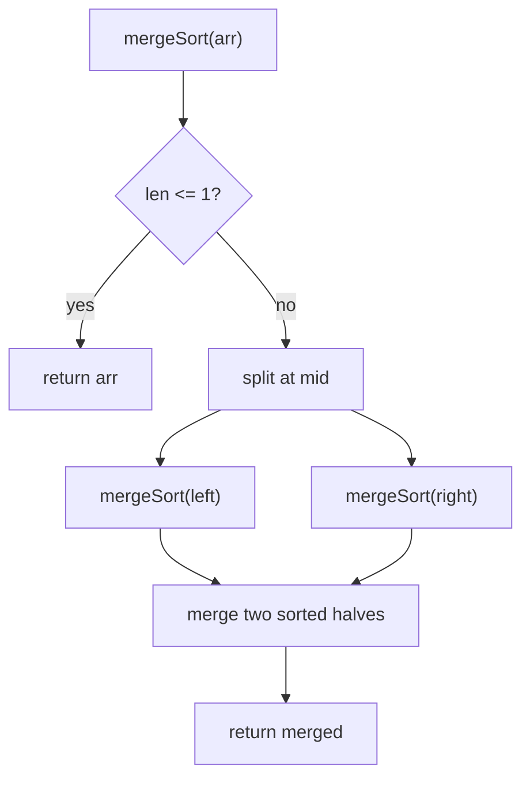

# 08 — Sorting & Searching (18)

> Graded problems for this pattern live in `easy.md`, `medium.md`, and `hard.md` in this same folder.

> **Goal:** be able to **implement merge sort and quick sort from scratch**, know their Big-O cold, and reach for **binary search** the instant an array is sorted (or the answer space is monotonic).

---

## The Pattern

Two skills interviewers actually test:

- **Implement a sort** — usually **merge sort** (stable, guaranteed O(n log n), divide-and-conquer) or **quick sort** (in-place, average O(n log n), partition around a pivot). Know the recurrence and the worst case.
- **Binary search** — halve the search space each step, O(log n). Works on a **sorted array** *or* on a **monotonic answer space** ("smallest k such that … is feasible" → binary-search on k). This second form ("binary search the answer") is the medium-level unlock: Koko Eating Bananas, Search in Rotated array.

The tell: "sorted" or "log n expected" → binary search. "Implement / kth largest / sort by frequency" → know your sorts + heap/quickselect.

## Diagram



```mermaid
flowchart LR
    A["lo .. hi"] --> B["mid = lo+(hi-lo)/2"]
    B --> C{target vs arr[mid]}
    C -->|equal| D[found]
    C -->|target < mid| E[hi = mid-1]
    C -->|target > mid| F[lo = mid+1]
```

## Reusable PHP Templates

```php
// Binary search (classic, sorted ascending)
function binarySearch(array $a, int $target): int {
    $lo = 0; $hi = count($a) - 1;
    while ($lo <= $hi) {
        $mid = $lo + intdiv($hi - $lo, 2);     // avoids overflow vs (lo+hi)/2
        if ($a[$mid] === $target) return $mid;
        $a[$mid] < $target ? $lo = $mid + 1 : $hi = $mid - 1;
    }
    return -1;                                 // not found
}
```

## Big-O Cheat Table

| Algorithm | Best | Average | Worst | Space | Stable |
|-----------|------|---------|-------|-------|:------:|
| Bubble / Insertion / Selection | O(n²) | O(n²) | O(n²) | O(1) | ins/bub yes |
| **Merge Sort** | O(n log n) | O(n log n) | O(n log n) | O(n) | ✅ |
| **Quick Sort** | O(n log n) | O(n log n) | O(n²) | O(log n) | ❌ |
| Binary Search | O(1) | O(log n) | O(log n) | O(1) | — |
| Heap / Quickselect (kth) | — | O(n) qs / O(n log k) heap | O(n²) qs | O(1)/O(k) | — |

---

## Common Traps / Interview Tips

- **`mid = lo + (hi-lo)/2`**, not `(lo+hi)/2` — the latter can overflow in fixed-int languages; say why even in PHP.
- **`<=` vs `<` in the loop** — `while ($lo <= $hi)` with `-1`/`+1` moves is the safe classic form; mixing bounds causes infinite loops.
- **Merge sort is stable, quick sort isn't** — state stability + the O(n) extra space vs quick's in-place O(log n) stack.
- **Quick sort worst case** is O(n²) on sorted/duplicate-heavy input — mention randomized or median-of-three pivot.
- **"Binary search the answer"** — when the ask is "minimum X such that feasible(X)", binary-search on X even though there's no sorted array in sight. This is the medium-level tell.
- **Kth largest**: heap is O(n log k) and simplest to explain; quickselect is O(n) average but say the O(n²) worst case.
