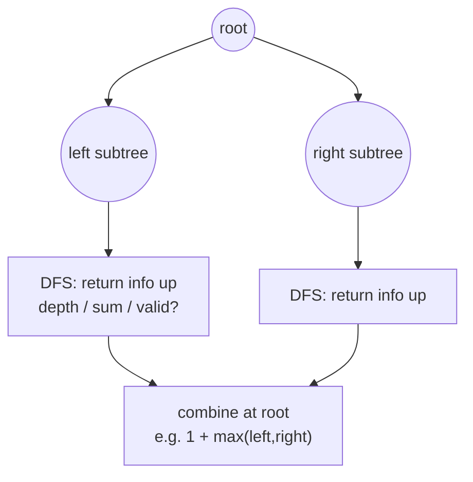
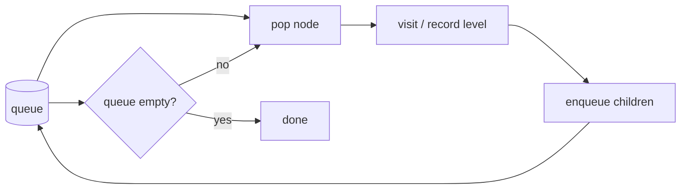

# 09 — Trees & BST (15)

> Graded problems for this pattern live in `easy.md`, `medium.md`, and `hard.md` in this same folder.

> **Goal:** solve almost every tree problem with one **recursive DFS** (return something up from each node), reach for **BFS** when the question mentions *levels*, and exploit **BST order** (inorder = sorted) when the tree is a search tree.

---

## The Pattern

- **DFS recursion** — the default. For each node: recurse left, recurse right, **combine** and return a value up (depth, sum, bool, a rebuilt node). "Think about one node, trust the recursion for the rest."
- **BFS / level order** — a **queue**, process node by node, one level per outer loop. Use whenever the ask says *level*, *layer*, *width*, *right-side view*, or *shortest depth*.
- **BST property** — left subtree < node < right subtree. Therefore **inorder traversal yields sorted order**, and search/insert is O(h). Validate a BST by carrying `(min, max)` bounds, not just comparing to the direct child.

The tell: "depth / path / same / symmetric / diameter" → DFS. "level / width / right view" → BFS. "BST + kth / validate / LCA" → use the ordering.

## Diagram





## Reusable PHP Templates

```php
class TreeNode {
    public $val; public $left; public $right;
    public function __construct($val = 0, $left = null, $right = null) {
        $this->val = $val; $this->left = $left; $this->right = $right;
    }
}

// A) DFS — return info up from each node
function dfs(?TreeNode $node) {
    if (!$node) return 0;                        // base case (empty subtree)
    $l = dfs($node->left);
    $r = dfs($node->right);
    return 1 + max($l, $r);                      // combine (this = depth)
}

// B) BFS — level order with a queue
function bfs(?TreeNode $root): array {
    if (!$root) return [];
    $out = []; $q = new SplQueue(); $q->enqueue($root);
    while (!$q->isEmpty()) {
        $level = []; $size = $q->count();        // fix the level width first
        for ($i = 0; $i < $size; $i++) {
            $n = $q->dequeue(); $level[] = $n->val;
            if ($n->left)  $q->enqueue($n->left);
            if ($n->right) $q->enqueue($n->right);
        }
        $out[] = $level;
    }
    return $out;
}
```

## Big-O Cheat Table

| Task | Approach | Time | Space |
|------|----------|------|-------|
| Any full traversal | DFS or BFS | O(n) | O(h) DFS / O(w) BFS |
| Max depth / diameter | DFS post-order | O(n) | O(h) |
| Level order / right view | BFS | O(n) | O(w) |
| BST search / insert | follow ordering | O(h) | O(1)/O(h) |
| Validate BST / kth smallest | inorder | O(n) | O(h) |

*h = height (O(log n) balanced, O(n) skewed); w = max width.*

---

## Common Traps / Interview Tips

- **Base case is `null`** — return the identity value (0 depth, true, null node). Forgetting it segfaults the recursion.
- **Validate BST needs bounds, not child compares** — checking only `node > node->left` passes invalid trees where a deep-left node exceeds an ancestor. Carry `(min, max)`.
- **BST inorder is sorted** — kth smallest, validate, and "closest value" all fall out of an inorder walk. Say this the moment you see "BST".
- **Fix the level size before the inner loop** (`$size = $q->count()`) — otherwise you mix levels together in BFS.
- **DFS space is O(h)** (stack), BFS space is O(w) (widest level) — pick based on whether the tree is deep-skewed or wide.
- **Diameter/height combos**: return the height *and* update a `&$best` by reference in one pass, rather than recomputing height per node (which is O(n²)).
