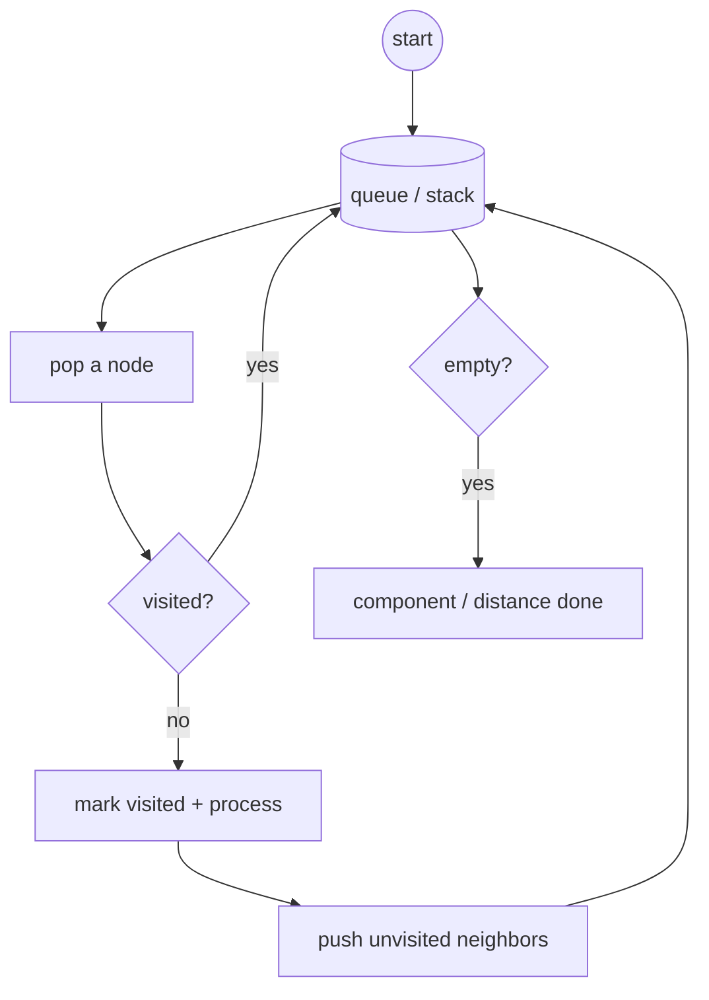

# 10 — Graphs · BFS / DFS (12)

> Graded problems for this pattern live in `easy.md`, `medium.md`, and `hard.md` in this same folder.

> **Goal:** see a grid or adjacency list as a graph, pick **BFS** (shortest path / level) vs **DFS** (connectivity / flood fill), always carry a **visited** set, and detect cycles for "can this be ordered?" questions.

---

## The Pattern

A graph is **nodes + edges**. Two representations, two traversals:

- **Grid** (matrix) — each cell is a node, neighbors are up/down/left/right. "Islands", "flood fill", "rotting oranges" are all grid graphs.
- **Adjacency list** — `node => [neighbors]`. Build it from an edge list first.

Traversal choice:
- **BFS** (queue, expands in rings) → **shortest path / fewest steps** in an *unweighted* graph, level-by-level spread (rotting oranges, word ladder).
- **DFS** (recursion or stack) → connectivity, counting components, flood fill, **cycle detection**.

Non-negotiable: a **visited** set (or mutate the grid), or you loop forever. For "can all tasks be ordered?" → **topological sort / cycle detection** on a directed graph.

The tell: "grid of 1s/0s", "connected", "shortest steps", "can you finish all courses" → graph traversal.

## Diagram



## Reusable PHP Templates

```php
// A) DFS flood fill on a grid (mutates grid as the visited marker)
function dfs(array &$grid, int $r, int $c): void {
    $rows = count($grid); $cols = count($grid[0]);
    if ($r < 0 || $c < 0 || $r >= $rows || $c >= $cols || $grid[$r][$c] !== '1') return;
    $grid[$r][$c] = '0';                              // mark visited
    dfs($grid, $r + 1, $c); dfs($grid, $r - 1, $c);
    dfs($grid, $r, $c + 1); dfs($grid, $r, $c - 1);
}

// B) BFS shortest path on an adjacency list
function bfs(array $adj, int $start): array {
    $dist = [$start => 0]; $q = new SplQueue(); $q->enqueue($start);
    while (!$q->isEmpty()) {
        $u = $q->dequeue();
        foreach ($adj[$u] ?? [] as $v) {
            if (!isset($dist[$v])) {                 // first time seen = shortest
                $dist[$v] = $dist[$u] + 1;
                $q->enqueue($v);
            }
        }
    }
    return $dist;
}
```

## Big-O Cheat Table

| Task | Traversal | Time | Space |
|------|-----------|------|-------|
| Traverse all / count components | DFS or BFS | O(V+E) | O(V) |
| Grid island / flood fill | DFS/BFS | O(R·C) | O(R·C) |
| Shortest path (unweighted) | BFS | O(V+E) | O(V) |
| Cycle detect / topo sort | DFS colors / Kahn | O(V+E) | O(V) |

---

## Common Traps / Interview Tips

- **Always mark visited** — on a grid, either flip the cell or keep a `visited` set. Skip it and BFS/DFS loops forever.
- **BFS for shortest, DFS for existence** — don't use DFS to find a shortest path in an unweighted graph; BFS's first arrival *is* the shortest.
- **Register the clone before recursing** (Clone Graph) — otherwise a neighbor points back and you recurse infinitely.
- **Multi-source BFS** (Rotting Oranges) — seed the queue with *all* sources at once; each outer layer is one time step.
- **Cycle detection needs 3 states** in a directed graph (unseen / in-current-path / done); a plain visited set can't tell a cross-edge from a back-edge.
- **Complexity is O(V+E)** for adjacency lists, **O(R·C)** for grids — state which and why (each node/edge or cell visited once).
- **Recursion depth on big grids** can overflow — mention an explicit stack or BFS as the iterative alternative.
