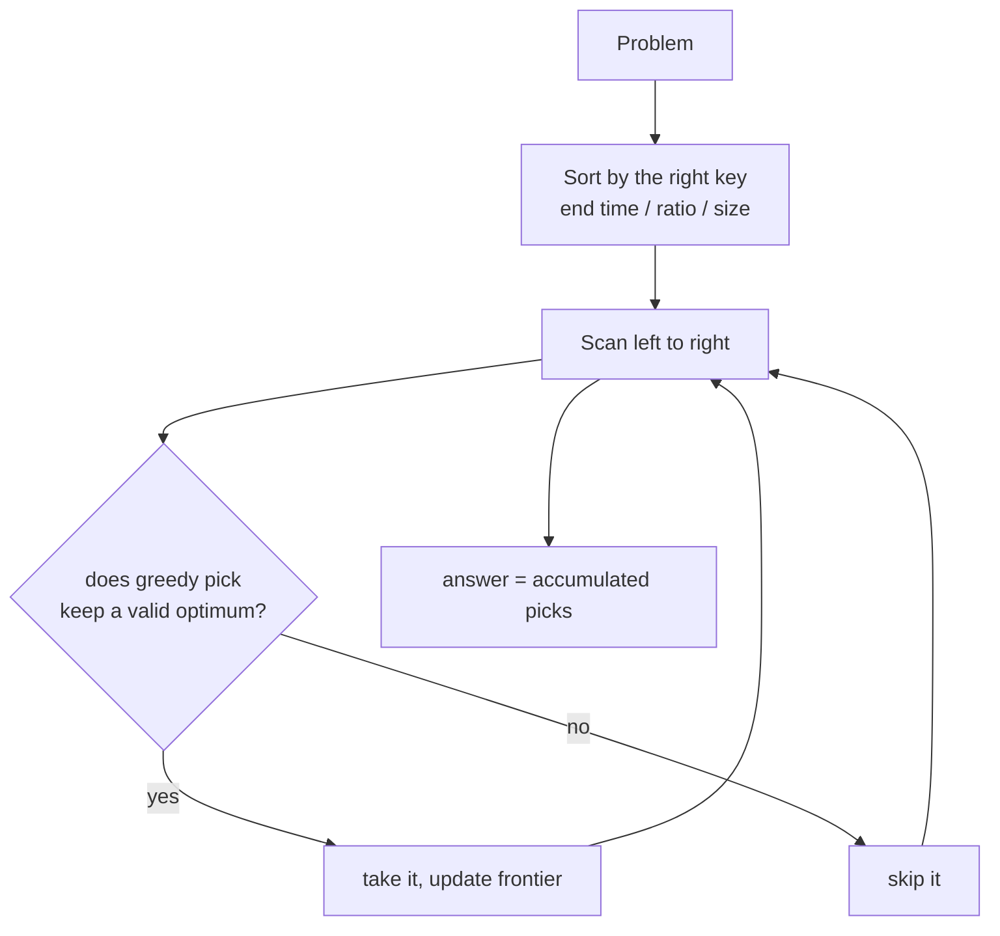

# 11 — Greedy (10)

> Graded problems for this pattern live in `easy.md`, `medium.md`, and `hard.md` in this same folder.

> **Goal:** recognize when a **locally optimal choice** provably leads to a **globally optimal answer** — usually after **sorting** — and be ready to justify *why* greedy is safe (the exchange argument).

---

## The Pattern

**Greedy** = at each step make the choice that looks best *right now* and never reconsider. It's fast (usually O(n log n) with a sort, O(n) without), but it's only correct when the problem has the **greedy-choice property**: a locally optimal pick is part of some global optimum.

Two recurring shapes:
- **Sort, then sweep** — sort by start / end / ratio, then make one pass taking or skipping (interval scheduling, assign cookies, burst balloons).
- **Running frontier** — track the best reachable state as you scan (Jump Game's farthest index, Gas Station's tank).

The tell: "maximum/minimum number of…", "can you reach…", "fewest…". Try greedy first; if a counterexample breaks it, fall back to **DP** (see the dp pattern).

## Diagram



## Reusable PHP Template

```php
// Interval / activity selection — sort by END, take non-overlapping
function maxNonOverlap(array $intervals): int {
    usort($intervals, fn ($a, $b) => $a[1] <=> $b[1]);  // earliest finish first
    $count = 0; $end = PHP_INT_MIN;
    foreach ($intervals as [$s, $e]) {
        if ($s >= $end) { $count++; $end = $e; }        // fits after the last taken
    }
    return $count;
}
```

## Big-O Cheat Table

| Shape | Cost | Example |
|-------|------|---------|
| Sort + one sweep | O(n log n) | intervals, cookies, balloons |
| Single scan frontier | O(n) | Jump Game, Gas Station |
| Greedy + heap | O(n log k) | Task Scheduler, meeting rooms |
| Greedy that's *wrong* → use DP | — | Coin Change with odd denominations |

---

## Common Traps / Interview Tips

- **Prove it's safe** — greedy needs justification. Say "taking the earliest-finishing interval leaves the most room" (exchange argument). If you can't argue it, suspect DP.
- **Coin Change is the classic greedy trap** — greedy works for real-world coins but *fails* for arbitrary denominations. Always name this; interviewers love it.
- **Sort key matters** — intervals: sort by **end** (not start) for max non-overlapping / min removals. Wrong key → wrong answer.
- **Jump/Gas run in one pass** — no need to simulate every path; track the farthest frontier or running tank.
- **Greedy vs DP** — if a locally best choice can force a worse global result, it's a DP problem. Coin Change min-coins is the textbook "looks greedy, is actually DP" case.
