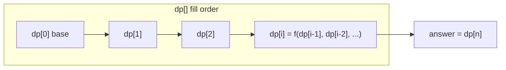
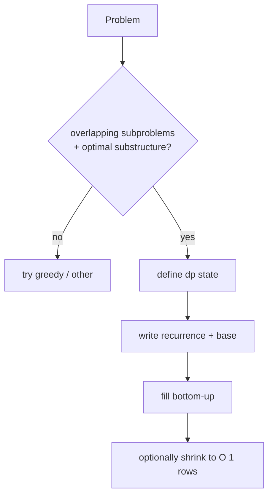

# 12 — Dynamic Programming (16)

> Graded problems for this pattern live in `easy.md`, `medium.md`, and `hard.md` in this same folder.

> **Goal:** turn overlapping recursion into a table. Define the **state**, write the **recurrence**, set the **base case**, then fill **bottom-up** (or memoize top-down). Start every DP by asking "what does `dp[i]` mean?"

---

## The Pattern

**DP** = recursion + remembering answers to subproblems (so you never recompute). A problem is DP when it has:
1. **Overlapping subproblems** — the same smaller inputs recur (Fibonacci calls `fib(n-2)` many times).
2. **Optimal substructure** — the best answer is built from best answers to subproblems.

The 4-step recipe interviewers want to hear:
1. **State** — what does `dp[i]` (or `dp[i][j]`) *mean*? (e.g. "min coins to make amount `i`".)
2. **Recurrence** — how does a state depend on smaller states?
3. **Base case** — the trivial smallest state(s).
4. **Order** — fill so dependencies come first (bottom-up), or memoize top-down.

Families: **1-D** (climbing stairs, house robber, coin change), **grid 2-D** (unique paths, min path sum, edit distance), **subsequence** (LIS, LCS), **knapsack** (partition equal subset).

The tell: "how many ways / min-max cost / longest …" **and** greedy gives a counterexample → DP.

## Diagram





## Reusable PHP Templates

```php
// A) 1-D bottom-up (climbing-stairs shape)
$dp = array_fill(0, $n + 1, 0);
$dp[0] = /* base */ 1;
for ($i = 1; $i <= $n; $i++) {
    $dp[$i] = /* recurrence in terms of $dp[$i-1], $dp[$i-2]... */;
}
return $dp[$n];

// B) Top-down memoization
function solve(int $i, array &$memo) {
    if (/* base */) return /* base value */;
    if (isset($memo[$i])) return $memo[$i];
    return $memo[$i] = /* recurrence */;
}
```

## Big-O Cheat Table

| Problem | State | Time | Space (rolled) |
|---------|-------|------|----------------|
| Climbing Stairs / Fibonacci | dp[i] | O(n) | O(1) |
| House Robber | dp[i] = best up to i | O(n) | O(1) |
| Coin Change (min) | dp[amt] | O(amount·coins) | O(amount) |
| Unique Paths / Min Path Sum | dp[r][c] | O(R·C) | O(C) |
| LIS | dp[i] | O(n²) or O(n log n) | O(n) |
| LCS / Edit Distance | dp[i][j] | O(n·m) | O(m) |

---

## Common Traps / Interview Tips

- **State the meaning of `dp[i]` out loud first** — every DP bug traces back to a fuzzy state definition. "dp[a] = fewest coins to make amount a."
- **Base case is where the recurrence bottoms out** — `dp[0]`, empty string, first row/column. Get it wrong and the whole table is off by one.
- **Coin Change is the greedy trap** — greedy fails on `[1,3,4]`, DP doesn't. Mention this even in the DP answer (ties back to the greedy pattern).
- **Roll the array** — most 1-D DPs need only the last one or two values → O(1) space; grid DPs need only the previous row → O(width). Show you know the optimization.
- **Order of loops matters** in unbounded vs 0/1 knapsack — Coin Change II (count ways) needs coins in the *outer* loop to avoid counting permutations.
- **Top-down vs bottom-up** — memoized recursion is easier to derive from the brute force; convert to bottom-up if the interviewer wants iterative / no stack.
