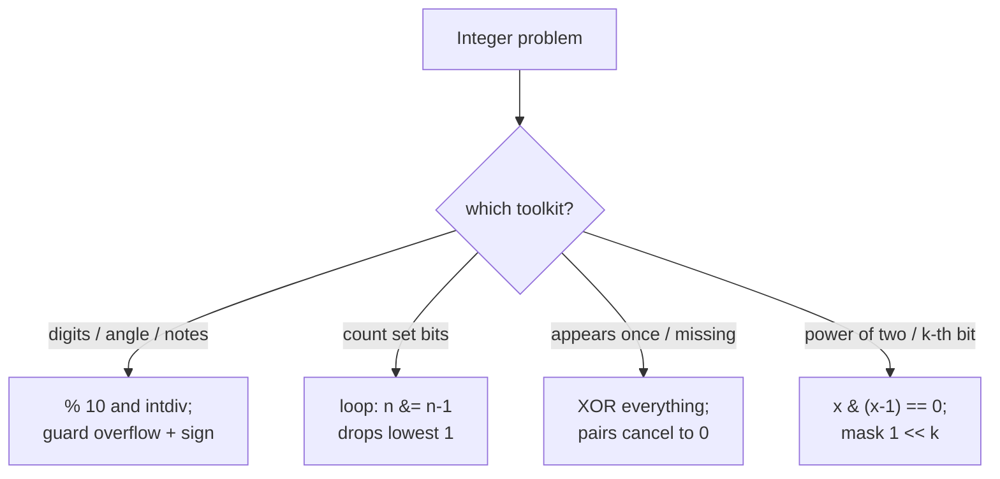

# 13 — Math & Bit Manipulation (12)

> Graded problems for this pattern live in `easy.md`, `medium.md`, and `hard.md` in this same folder.

> **Goal:** handle **digit/number math** cleanly (`%`, `intdiv`, overflow guards) and know the **bit tricks** — `x & (x-1)` clears the lowest set bit, **XOR** cancels pairs, `1 << k` masks the k-th bit.

---

## The Pattern

Two loosely related toolkits interviewers mix in:

- **Number/digit math** — peel digits with `% 10` and `intdiv(n, 10)`, watch for **overflow** and **negative/zero** edge cases. Often just careful arithmetic (clock angle, currency notes, reverse integer).
- **Bit manipulation** — treat an int as 32 bits:
  - `x & 1` → last bit (odd/even); `x >> 1` → drop it.
  - `x & (x - 1)` → **clears the lowest set bit** (count bits, power-of-two check).
  - `a ^ b` → **XOR**: `x ^ x = 0`, `x ^ 0 = x` → cancels duplicates (Single Number, Missing Number).
  - `1 << k` → a mask for the k-th bit.

The tell: "without extra space", "count bits", "appears once/twice", "power of two" → bit tricks. "angle / digits / notes / reverse number" → digit math.

## Diagram



## Reusable PHP Templates

```php
// Peel digits of a number
$n = abs($num);
while ($n > 0) { $digit = $n % 10; $n = intdiv($n, 10); /* use $digit */ }

// Count set bits — Brian Kernighan
function popcount(int $x): int {
    $c = 0;
    while ($x) { $x &= $x - 1; $c++; }   // each step removes one 1-bit
    return $c;
}

// XOR fold — the unique element among pairs
$acc = 0;
foreach ($nums as $x) $acc ^= $x;        // pairs cancel, lone value remains
```

## Big-O Cheat Table

| Task | Trick | Time | Space |
|------|-------|------|-------|
| Count set bits | `x &= x-1` | O(#set bits) | O(1) |
| Single Number | XOR fold | O(n) | O(1) |
| Missing Number | XOR or sum formula | O(n) | O(1) |
| Power of Two | `x & (x-1) == 0` | O(1) | O(1) |
| Reverse / digit math | `%10`, `intdiv` | O(digits) | O(1) |

---

## Common Traps / Interview Tips

- **Clock angle** — the hour hand moves *continuously*: at 3:30 it's halfway to 4, so include the `0.5 * minutes` term. Return `min(angle, 360-angle)`.
- **Overflow** — Reverse Integer / Palindrome must guard the 32-bit range; PHP auto-promotes to float, but state the check as if in a fixed-int language.
- **XOR beats hashing on space** — Single Number / Missing Number in O(1) space is the point; leading with a hash set misses the intended trick.
- **`x & (x-1)`** clears the lowest set bit → counting bits and power-of-two both fall out of it. Memorize this identity.
- **Power of two edge case** — guard `n > 0` first; `0 & -1 == 0` would falsely report true.
- **`intdiv` not `/`** for integer division — `/` yields a float in PHP and breaks digit peeling.
