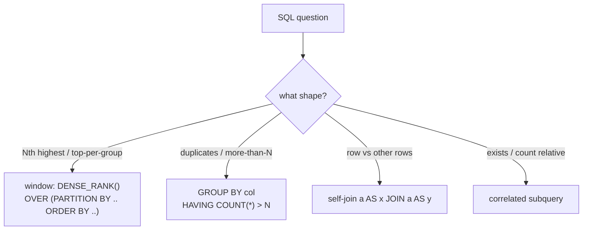

# 14 — SQL (8)

> Graded problems for this pattern live in `easy.md`, `medium.md`, and `hard.md` in this same folder.

> **Goal:** think in **sets, not loops**. Master the four query patterns that cover almost every interview SQL: **self-join**, **correlated subquery**, **`GROUP BY … HAVING`**, and **window functions** (`RANK` / `DENSE_RANK`). Code blocks here are **SQL**, not PHP.

---

## The Pattern

SQL problems test whether you can express a result **declaratively** over sets:

- **Self-join** — compare rows of a table to other rows of the *same* table (employee vs manager, employee vs higher-paid peers).
- **Correlated subquery** — an inner query that references the outer row ("count how many salaries are higher than mine").
- **`GROUP BY … HAVING`** — aggregate into buckets, then filter the buckets (`HAVING count > 1` for duplicates).
- **Window functions** — `RANK()`, `DENSE_RANK()`, `ROW_NUMBER()` over `PARTITION BY … ORDER BY …` for "Nth highest", "top per group" without collapsing rows.

The tell: "second/Nth highest" → `DENSE_RANK` or `LIMIT/OFFSET` + subquery. "more than / duplicate" → `GROUP BY HAVING` or self-join. "highest per department" → window `PARTITION BY`.

## Diagram



## Reusable Query Patterns

```sql
-- Self-join: rows of a table compared to other rows
SELECT e.name
FROM   Employee e
JOIN   Employee m ON e.managerId = m.id
WHERE  e.salary > m.salary;

-- GROUP BY ... HAVING: filter aggregated buckets
SELECT col
FROM   T
GROUP BY col
HAVING COUNT(*) > 1;

-- Window function: rank within partitions without collapsing rows
SELECT name, salary,
       DENSE_RANK() OVER (PARTITION BY deptId ORDER BY salary DESC) AS rnk
FROM   Employee;
```

## Big-O / Cost Cheat Table

| Pattern | Use for | Notes |
|---------|---------|-------|
| `LIMIT n OFFSET k` | Nth row after sort | simplest for "2nd highest", handle NULL when absent |
| `DENSE_RANK()` | Nth **distinct** value / ties | ties share a rank, no gaps |
| `GROUP BY … HAVING` | duplicates, counts per key | filter *after* aggregation |
| Self-join | compare rows within a table | watch the join condition, avoid cartesian blow-up |
| Correlated subquery | "count/exists relative to this row" | runs per outer row — can be slow |

---

## Common Traps / Interview Tips

- **`LIMIT/OFFSET` returns an empty set, not NULL** — wrap it in an outer `SELECT (…)` or use `IFNULL`/`MAX` so "no second salary" yields `NULL` as required.
- **`RANK` vs `DENSE_RANK` vs `ROW_NUMBER`** — `RANK` leaves gaps after ties (1,1,3), `DENSE_RANK` doesn't (1,1,2), `ROW_NUMBER` breaks ties arbitrarily (1,2,3). "Nth *distinct*" → `DENSE_RANK`.
- **`WHERE` filters rows, `HAVING` filters groups** — you can't put an aggregate in `WHERE`. Duplicates/counts belong in `HAVING`.
- **`LEFT JOIN … WHERE right IS NULL`** is the idiom for "rows with no match" (never ordered, no address).
- **`DISTINCT` before ranking** for salary problems — duplicate top salaries otherwise make "second highest" wrong.
- **NULLs in aggregates** — `COUNT(col)` skips NULLs, `COUNT(*)` doesn't; know which you want.
- **Say "sets, not loops"** — interviewers want a declarative query, not a mental `for` loop over rows.
