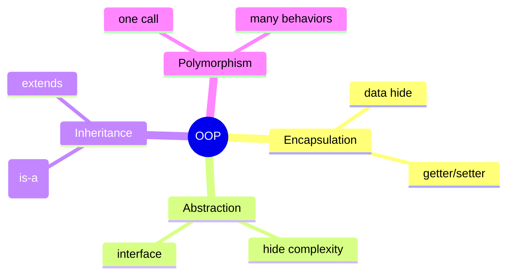
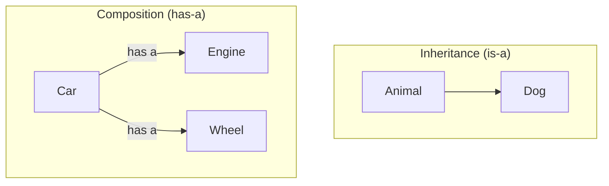
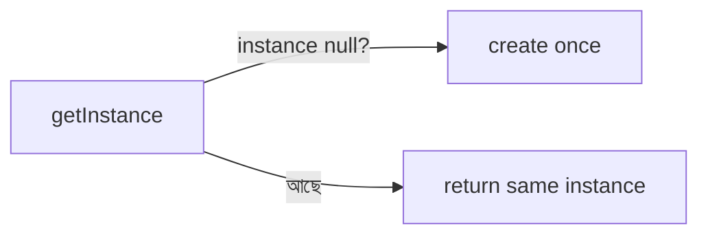
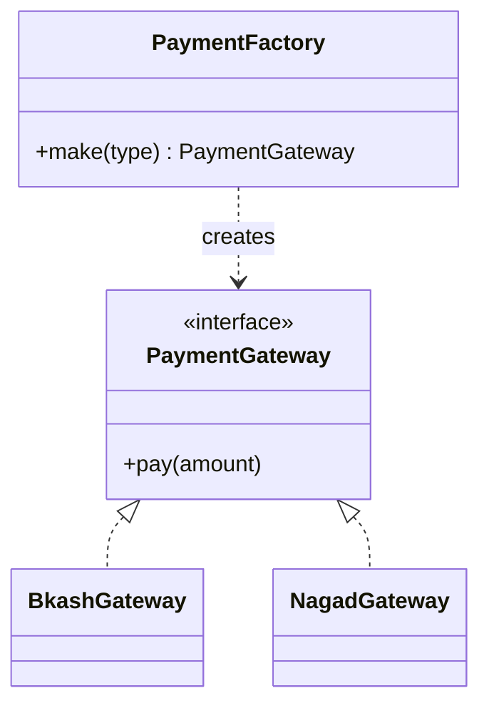
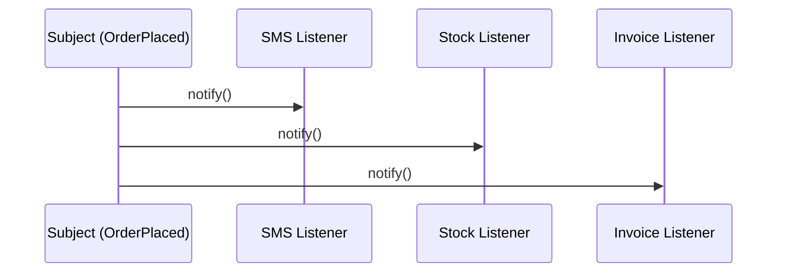
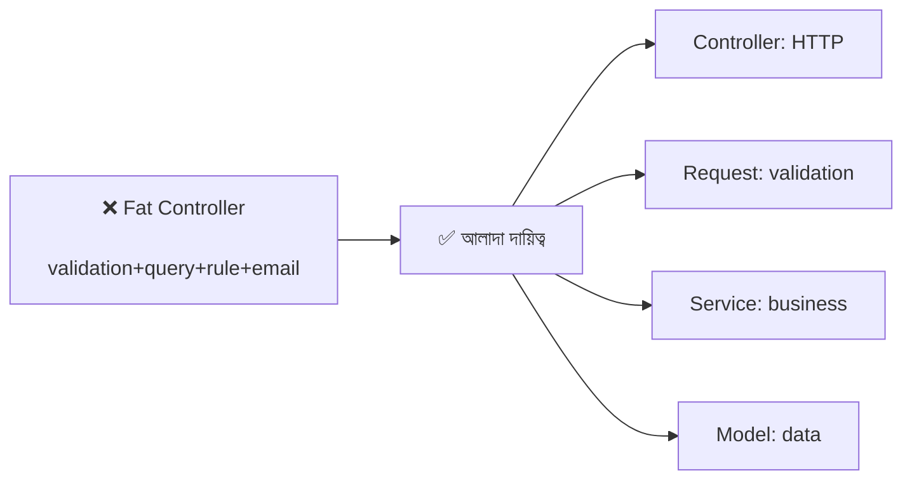
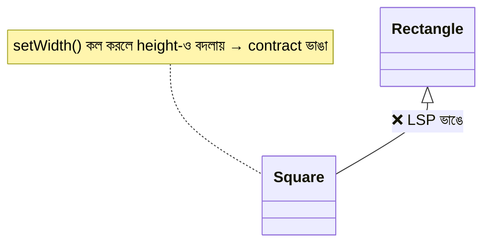
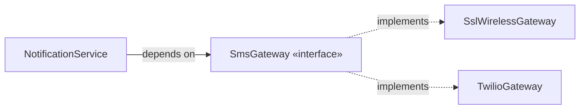
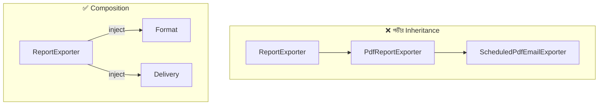

# 01 — OOP & Design Patterns · Deep-Dive (20 Questions)

> **Bilingual format:** English question + English terms, Bengali explanation।
> প্রশ্ন সাজানো হয়েছে সহজ (MCQ/trainee) → মাঝারি → senior stretch পর্যন্ত।
> Pairs with `../01-oop-and-design-patterns.md`. WellDev MCQ (১ আগস্ট) + ১ম/২য় technical round দুটোর জন্যই।

---

### ১. What are the 4 pillars of OOP?

**Description:** OOP-এর চারটি মূল স্তম্ভ — Encapsulation, Abstraction, Inheritance, Polymorphism। এগুলো শুধু সংজ্ঞা নয়, প্রতিটা একটা করে সমস্যা সমাধান করে।

**মনে রাখার পয়েন্ট:**
- **Encapsulation** = data + সেটা বদলানোর নিয়ম এক জায়গায়, বাইরে থেকে সরাসরি access বন্ধ (`private`)।
- **Abstraction** = "কী করে" দেখাও, "কীভাবে করে" লুকাও।
- **Inheritance** = code reuse, "is-a" সম্পর্ক (`Dog is-a Animal`)।
- **Polymorphism** = এক method call, object অনুযায়ী ভিন্ন behavior।
- MCQ trap: "Compilation" OOP pillar নয় — এটা distractor।

---

### ২. What is Encapsulation and why does a public setter break it?

**Description:** Encapsulation মানে object-এর internal state লুকিয়ে রাখা এবং শুধু নিয়ন্ত্রিত method দিয়ে পরিবর্তন করতে দেওয়া। সব field-এ public setter বসালে সেই সুরক্ষা ভেঙে যায়।

**মনে রাখার পয়েন্ট:**
- `private balance` + `deposit()` / `withdraw()` — validation ছাড়া balance বদলানো যায় না।
- খারাপ: `account.balance = -999` — invalid state ঢুকে গেল।
- getter/setter থাকা মানেই encapsulation নয়; আসল কথা **invariant রক্ষা** (নিয়ম ভাঙতে না দেওয়া)।
- এক লাইনে: "state আর তার rule একসাথে রাখো"।

---

### ৩. Abstraction vs Encapsulation — পার্থক্য কী? (classic trap)

**Description:** দুটোই "লুকানো" নিয়ে, তাই MCQ-তে গুলিয়ে দেয়। পার্থক্য: কী লুকাচ্ছ।

**মনে রাখার পয়েন্ট:**
- **Abstraction** = design level — *complexity/implementation* লুকানো (interface দেখাও)।
- **Encapsulation** = implementation level — *data* লুকানো (`private` field)।
- উদাহরণ: `car.drive()` = abstraction (engine logic লুকানো); `private fuelLevel` = encapsulation।
- এক বাক্যে: "Abstraction লুকায় জটিলতা, Encapsulation লুকায় ডেটা"।

---

### ৪. Inheritance vs Composition — কখন কোনটা?

**Description:** Inheritance ("is-a") code reuse দেয় কিন্তু tight coupling আনে। Composition ("has-a") বেশি নমনীয়। আধুনিক rule: **composition over inheritance**.

**মনে রাখার পয়েন্ট:**
- Inheritance ব্যবহার করো শুধু যখন সত্যিই "is-a" (Dog is-a Animal)।
- Composition ব্যবহার করো "has-a"-তে (Car has-a Engine)।
- Inheritance সমস্যা: **fragile base class** — parent বদলালে সব child কাঁপে।
- Interview line: "is-a সন্দেহ হলে has-a বেছে নাও"।

---

### ৫. What is Polymorphism? Compile-time vs Run-time?

**Description:** এক interface, ভিন্ন behavior। দুই ধরন — compile-time (overloading) আর run-time (overriding)।

**মনে রাখার পয়েন্ট:**
- **Compile-time / static** = **overloading** — একই নাম, ভিন্ন parameter।
- **Run-time / dynamic** = **overriding** — child parent-এর method নতুন করে লেখে।
- উদাহরণ: `animal.speak()` → Dog "Woof", Cat "Meow" (runtime)।
- আসল শক্তি: `if/else` chain-এর বদলে ভিন্ন class — কোড extensible হয়।

---

### ৬. Method Overloading vs Overriding — পুরো পার্থক্য?

**Description:** দুটোই polymorphism, কিন্তু আলাদা।

| | Overloading | Overriding |
|---|-------------|------------|
| Time | Compile-time | Run-time |
| Signature | ভিন্ন params | একই signature |
| Class | একই class | parent + child |

**মনে রাখার পয়েন্ট:**
- Overloading: `add(int,int)` আর `add(int,int,int)` — একই class।
- Overriding: child-এ `@Override toString()` — parent-এর টা replace।
- MCQ trap: overloading = compile-time (static), overriding = run-time (dynamic) — উল্টো দিও না।

---

### ৭. Class vs Object vs Interface vs Abstract Class?

**Description:** OOP-এর building block গুলোর পার্থক্য — MCQ-তে খুব common।

**মনে রাখার পয়েন্ট:**
- **Class** = blueprint; **Object** = সেই blueprint-এর instance।
- **Interface** = pure contract (শুধু method signature), একটা class অনেক interface implement করতে পারে।
- **Abstract class** = আংশিক implementation, instantiate করা যায় না, একটাই extend করা যায়।
- Java rule: `extends` একটা class, `implements` অনেক interface।

---

### ৮. Access modifiers (public / private / protected) কী করে?

**Description:** Encapsulation প্রয়োগের হাতিয়ার — কে কোন member দেখতে/ব্যবহার করতে পারবে তা ঠিক করে।

**মনে রাখার পয়েন্ট:**
- **public** = সবাই access করতে পারে।
- **private** = শুধু নিজের class-এর ভেতরে।
- **protected** = নিজের class + child class।
- Default (Java package-private) = একই package-এ।
- Encapsulation-এর জন্য field সাধারণত `private`, access method `public`।

---

### ৯. Static vs Instance member — পার্থক্য?

**Description:** `static` member class-এর সাথে যুক্ত, object-এর সাথে নয়।

**মনে রাখার পয়েন্ট:**
- **Instance member** = প্রতিটা object-এর আলাদা copy।
- **Static member** = পুরো class-এ একটাই copy, object ছাড়াই access (`Math.PI`)।
- Static method-এ `this` নেই, instance field সরাসরি ব্যবহার করা যায় না।
- Utility method (`Math.max()`) সাধারণত static।

---

### ১০. What is a constructor? Constructor overloading?

**Description:** Object তৈরির সময় যে special method চলে — field initialize করে।

**মনে রাখার পয়েন্ট:**
- Constructor-এর নাম class-এর নামের সমান, কোনো return type নেই।
- **Default constructor** = parameter ছাড়া (না লিখলে compiler দেয়)।
- **Overloading** = ভিন্ন parameter সহ একাধিক constructor।
- `super()` দিয়ে parent constructor call হয়।

---

### ১১. Singleton Pattern — কী, কখন, বিপদ কী?

**Description:** একটা class-এর শুধু **একটাই instance** নিশ্চিত করা (DB connection, config, logger)।

**মনে রাখার পয়েন্ট:**
- উদ্দেশ্য: global-এ একটাই instance।
- সমস্যা: **global mutable state**, লুকানো dependency, test-এ isolation ভাঙে — তাই আজ প্রায় anti-pattern।
- আধুনিক বিকল্প: container-managed singleton (`app()->singleton()`) — একটাই instance কিন্তু injectable/swappable।
- MCQ উত্তর সাধারণত: "ensures a single instance"।

---

### ১২. Factory Pattern — কী সমস্যা সমাধান করে?

**Description:** Object তৈরির সিদ্ধান্ত (কোন class) এক জায়গায় নিয়ে আসা — caller `new` জানে না, শুধু interface পায়।

**মনে রাখার পয়েন্ট:**
- Factory = creation logic-এর `if/else` caller থেকে সরিয়ে এক জায়গায়।
- caller শুধু interface পায় → নতুন type যোগ করলে caller অপরিবর্তিত (OCP)।
- Laravel জীবন্ত উদাহরণ: `Cache::store('redis')`, `Queue::connection()`।
- Creational pattern।

---

### ১৩. Observer Pattern — কীভাবে কাজ করে?

**Description:** এক ঘটনায় (subject) অনেক প্রতিক্রিয়া (observers) — subject জানে না কে শুনছে।

**মনে রাখার পয়েন্ট:**
- One-to-many: subject বদলালে সব subscriber notify হয়।
- Publisher জানে না কে শুনছে → নতুন reaction যোগে publisher untouched (OCP)।
- Laravel: Event/Listener, Model Observer।
- Behavioural pattern। উদাহরণ: event listener, UI button click।

---

### ১৪. Strategy Pattern — কী এবং Factory-র সাথে সম্পর্ক?

**Description:** এক কাজের একাধিক algorithm runtime-এ বদলযোগ্য করা (discount, shipping, tax)।

**মনে রাখার পয়েন্ট:**
- Strategy = interchangeable algorithm, common interface-এর পেছনে।
- Factory বেছে দেয় *কোন* strategy, Strategy কাজটা করে — প্রায়ই জোড়ায়।
- `if paymentType == card ... else if bkash ...` এর বদলে `PaymentStrategy` inject।
- Behavioural pattern। OCP-র বাস্তব রূপ।

---

### ১৫. SOLID — S (Single Responsibility Principle) কী?

**Description:** একটা class-এর বদলানোর **কারণ একটাই** হওয়া উচিত।

**মনে রাখার পয়েন্ট:**
- সংজ্ঞা "এক কাজ" নয় — "এক কারণে change"।
- লক্ষণ: fat controller (validation + query + business + notification একসাথে)।
- অতিরিক্ত SRP-ও রোগ: ৫ লাইনের জন্য ৫ class — pragmatism রাখো।
- এক লাইনে: "change-এর কারণ আলাদা রাখো"।

---

### ১৬. SOLID — O (Open/Closed Principle) কী?

**Description:** নতুন feature-এ পুরনো কোড **modify না করে extend** করা যাবে।

**মনে রাখার পয়েন্ট:**
- লক্ষণ: নতুন type এলে ছড়ানো `switch/if-else` সব জায়গায় হাত দিতে হয় → OCP ভাঙা।
- অস্ত্র: interface + polymorphism, Strategy pattern।
- উদাহরণ: নতুন discount = নতুন class + registration, calculator untouched।
- সতর্কতা: আগে থেকে over-abstraction ভুল — Rule of Three (৩য় বার variation এলে generalize)।

---

### ১৭. SOLID — L (Liskov Substitution Principle) কী?

**Description:** Subclass parent-এর জায়গায় বসলে behavior ভাঙবে না।

**মনে রাখার পয়েন্ট:**
- ভাঙার চিহ্ন: subclass-এ `throw NotSupportedException` বা খালি override।
- ক্লাসিক: `Square extends Rectangle` — setWidth/setHeight contract ভাঙে।
- নিয়ম: precondition কঠোরতর নয়, postcondition শিথিলতর নয়।
- এক লাইনে: "child কে parent-এর জায়গায় বসালে caller কিছু টের পাবে না"।

---

### ১৮. SOLID — I (Interface Segregation Principle) কী?

**Description:** মোটা interface ভেঙে ছোট, focused interface রাখা — client যে method ব্যবহার করে না তার ওপর নির্ভর করবে না।

**মনে রাখার পয়েন্ট:**
- খারাপ: `ReportExporter` interface-এ ২০টা method (exportPdf, emailReport, schedule...)।
- ভালো: ছোট contract — `PdfExportable`, `Emailable` আলাদা।
- Laravel রূপ: `Queueable`, `ShouldQueue`, `Arrayable` — একেকটা এক promise।
- এক লাইনে: "ছোট promise দাও"।

---

### ১৯. SOLID — D (Dependency Inversion) ও Dependency Injection?

**Description:** High-level module concrete class-এর ওপর নয়, **abstraction**-এর ওপর নির্ভর করবে। Laravel Service Container এরই বাস্তবায়ন।

**মনে রাখার পয়েন্ট:**
- **DIP** (principle) ≠ **DI** (technique) — DI হলো DIP অর্জনের উপায়।
- `new SmsGateway()` service-এর ভেতরে = hard coupling; constructor-এ interface নাও।
- লাভ: implementation swap (bKash→Nagad) + test-এ mock inject।
- সব কিছুতে interface নয় — যেখানে variation/mock দরকার সেখানেই (YAGNI)।

---

### ২০. [Stretch] Composition over Inheritance — বাস্তব refactoring কীভাবে? + Decorator

**Description:** Inheritance hierarchy গভীর হয়ে জট পাকালে behavior গুলো interface-এ বের করে inject করা (flat composition)। Decorator = composition দিয়ে behavior layering।

**মনে রাখার পয়েন্ট:**
- Inheritance সমস্যা: fragile base class + multiple axis variation → class বিস্ফোরণ।
- সংকেত: `ScheduledPdfEmailReportExporter` টাইপ নাম মানে composition দরকার।
- Refactor: ভিন্ন behavior interface-এ বের করে constructor-এ inject → hierarchy flat।
- **Decorator**: `CachedReportService` wraps `ReportService` — inheritance ছাড়াই extension।
- এক লাইনে: "প্যাটার্ন খরচসহ আসে — সমস্যা থাকলে কেনো, ফ্যাশনে নয়"।

---

## Quick self-check (এই ২০টা পারলে OOP round শক্ত)
১-১০: pillars, encapsulation trap, inheritance vs composition, polymorphism, overload/override, class types, access modifiers, static, constructor।
১১-১৪: Singleton, Factory, Observer, Strategy।
১৫-১৯: SOLID (S,O,L,I,D)।
২০: Composition over inheritance + Decorator (stretch)।
