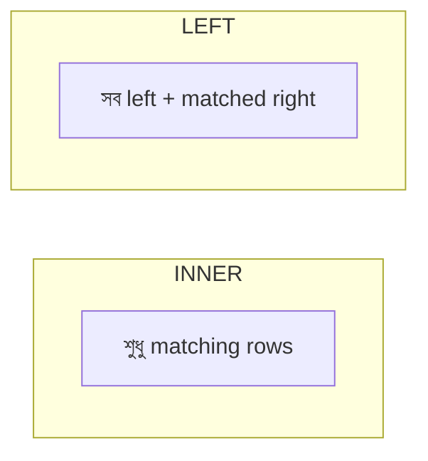
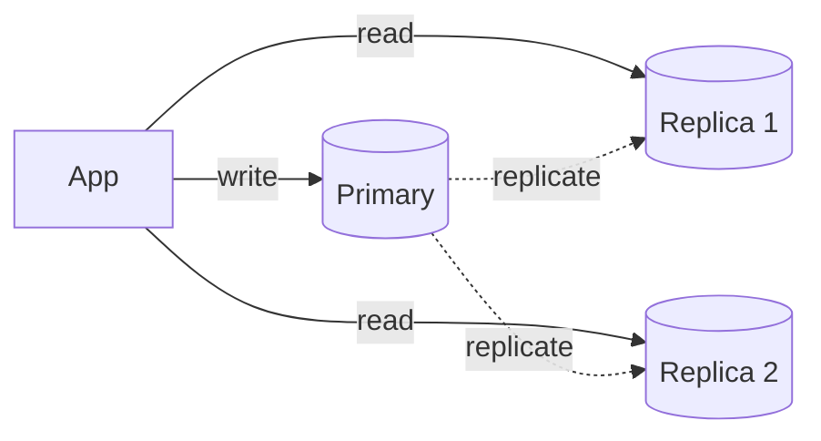

# 04 — SQL & Databases · Deep-Dive (20 Questions)

> **Bilingual:** English question + terms, Bengali explanation। সহজ → senior stretch।
> Pairs with `../04-sql-databases.md`. "Highest salary" reported — এটা cold জানো।

---

### ১. SQL clause গুলোর execution order কী?

**Description:** যে order-এ লেখো তা নয়, DB আলাদা order-এ চালায়।

**মনে রাখার পয়েন্ট:**
- `FROM → WHERE → GROUP BY → HAVING → SELECT → ORDER BY → LIMIT`।
- তাই `SELECT`-এর alias `WHERE`-এ ব্যবহার করা যায় না (SELECT পরে চলে)।
- `WHERE` grouping-এর আগে, `HAVING` পরে।

---

### ২. INNER vs LEFT vs RIGHT vs FULL JOIN?

**Description:** দুই table কীভাবে মেলানো হবে তার ধরন।



**মনে রাখার পয়েন্ট:**
- **INNER**: দুই table-এ match করা rows।
- **LEFT**: সব left row + matched right (না মিললে NULL)।
- **RIGHT**: উল্টো।
- **FULL OUTER**: দুই দিকের সব row।
- MCQ trap: "unmatched rows রাখতে চাই" → LEFT/RIGHT, INNER নয়।

---

### ৩. WHERE vs HAVING — পার্থক্য?

**Description:** দুটোই filter, কিন্তু কখন চলে আলাদা।

**মনে রাখার পয়েন্ট:**
- **WHERE**: row filter, grouping-এর **আগে**, aggregate ব্যবহার করা যায় না।
- **HAVING**: group filter, `GROUP BY`-এর **পরে**, aggregate (`COUNT`, `SUM`) দিয়ে।
- উদাহরণ: `HAVING COUNT(*) > 5` — WHERE-এ এটা লেখা যায় না।

---

### ৪. Highest salary — query কী? (reported)

**Description:** সবচেয়ে বেশি salary বের করা — সহজ কিন্তু reported।

```sql
SELECT MAX(salary) FROM employees;
```

**মনে রাখার পয়েন্ট:**
- পুরো row চাইলে: `SELECT * FROM employees ORDER BY salary DESC LIMIT 1;`
- একাধিক জন সর্বোচ্চ পেলে দুটোই দেখাতে subquery লাগে।

---

### ৫. 2nd highest salary — subquery কীভাবে? (memorize)

**Description:** সর্বোচ্চ বাদ দিয়ে তার নিচের সর্বোচ্চ।

```sql
-- Subquery
SELECT MAX(salary) FROM employees
WHERE salary < (SELECT MAX(salary) FROM employees);

-- LIMIT/OFFSET
SELECT DISTINCT salary FROM employees
ORDER BY salary DESC LIMIT 1 OFFSET 1;
```

**মনে রাখার পয়েন্ট:**
- Nth highest (dense): `DENSE_RANK() OVER (ORDER BY salary DESC)` তারপর `= N` filter।
- `DISTINCT` জরুরি — একই salary একাধিক থাকলে।
- এটা মুখস্থ রাখো — খুব common।

---

### ৬. Aggregate functions + GROUP BY কীভাবে?

**Description:** row গুলোকে group করে সারাংশ (count, sum, avg)।

```sql
SELECT dept_id, COUNT(*) AS headcount, AVG(salary) AS avg_sal
FROM employees
GROUP BY dept_id
HAVING COUNT(*) > 5;
```

**মনে রাখার পয়েন্ট:**
- `COUNT, SUM, AVG, MIN, MAX`।
- `SELECT`-এ non-aggregate column থাকলে সেটা `GROUP BY`-তে থাকতে হবে।
- Group filter = HAVING।

---

### ৭. Subquery vs JOIN — কখন কোনটা?

**Description:** দুটোই related data আনে, performance ও readability আলাদা।

**মনে রাখার পয়েন্ট:**
- JOIN সাধারণত দ্রুত (optimizer ভালো handle করে)।
- Correlated subquery প্রতি row-এ চলে → ধীর হতে পারে।
- "exists কিনা" চেক-এ `EXISTS` subquery পরিষ্কার।

---

### ৮. Normalization — 1NF, 2NF, 3NF কী?

**Description:** redundancy কমাতে table ভাঙার নিয়ম।

**মনে রাখার পয়েন্ট:**
- **1NF**: atomic value, repeating group নেই।
- **2NF**: 1NF + no partial dependency (composite key-এর অংশের ওপর নির্ভর নয়)।
- **3NF**: 2NF + no transitive dependency (non-key → non-key নির্ভরতা নেই)।
- **Denormalization**: read speed-এর জন্য ইচ্ছাকৃত redundancy।

---

### ৯. Index কীভাবে কাজ করে এবং কখন কাজ করে না?

**Description:** Index = আলাদা sorted structure (B-tree), full scan এড়ায়।

```mermaid
graph LR
    A[Query WHERE email=x] --> B[Index B-tree O(log n)]
    B --> C[Row pointer]
```

**মনে রাখার পয়েন্ট:**
- Read O(n) → O(log n)। কিন্তু write ধীর (index update) + storage বাড়ে।
- Index কাজ করে না: `LIKE '%x'` (leading wildcard), column-এ function (`WHERE YEAR(date)=`), low cardinality।
- Composite index-এ left-most column rule।

---

### ১০. Primary key vs Foreign key vs Unique?

**Description:** Constraint-এর তিন ধরন।

**মনে রাখার পয়েন্ট:**
- **Primary key**: unique + NOT NULL, auto-indexed, table-এ একটাই।
- **Foreign key**: অন্য table-এর PK-কে reference (referential integrity)।
- **Unique**: unique কিন্তু NULL হতে পারে, একাধিক থাকতে পারে।

---

### ১১. ACID properties কী?

**Description:** Transaction-এর চার গুণ যা reliability দেয়।

**মনে রাখার পয়েন্ট:**
- **Atomicity** — সব হবে বা কিছুই না।
- **Consistency** — valid state → valid state।
- **Isolation** — concurrent txn একে অন্যকে দেখে না।
- **Durability** — commit হলে crash-এও থাকে।

---

### ১২. SQL vs NoSQL — কখন কোনটা?

**Description:** relational vs non-relational database।

**মনে রাখার পয়েন্ট:**
- **SQL** (MySQL, Postgres): fixed schema, relation, ACID, complex query।
- **NoSQL** (MongoDB, Redis): flexible schema, horizontal scale, document/key-value।
- MongoDB = document, Redis = key-value/cache।

---

### ১৩. DELETE vs TRUNCATE vs DROP?

**Description:** তিনটাই মুছে, কিন্তু আলাদা।

**মনে রাখার পয়েন্ট:**
- **DELETE**: row মুছে (WHERE দেওয়া যায়), rollback সম্ভব, ধীর।
- **TRUNCATE**: সব row দ্রুত মুছে, structure রাখে, rollback নেই (DDL)।
- **DROP**: পুরো table structure সহ মুছে।

---

### ১৪. Transaction ও রোলব্যাক কীভাবে?

**Description:** একাধিক statement এক unit হিসেবে চালানো।

```sql
BEGIN;
UPDATE accounts SET balance = balance - 100 WHERE id = 1;
UPDATE accounts SET balance = balance + 100 WHERE id = 2;
COMMIT;   -- সমস্যা হলে ROLLBACK;
```

**মনে রাখার পয়েন্ট:**
- Money transfer-এর ক্লাসিক উদাহরণ — একটা fail করলে দুটোই বাতিল।
- `COMMIT` লিখলে permanent, `ROLLBACK` সব বাতিল।
- Atomicity নিশ্চিত করে।

---

### ১৫. N+1 query problem কী?

**Description:** এক query-র পর প্রতি row-এর জন্য আরেকটা query — মোট N+1।

**মনে রাখার পয়েন্ট:**
- ১টা query ১০০ order আনে, তারপর প্রতি order-এর customer আনতে ১০০ query = ১০১।
- সমাধান: **eager loading** / JOIN (`with()` in Laravel)।
- Interview-তে DB optimization প্রশ্নে খুব আসে।

---

### ১৬. Transaction Isolation Levels?

**Description:** concurrent transaction একে অন্যকে কতটা দেখবে।

**মনে রাখার পয়েন্ট:**
- Read Uncommitted → Read Committed → Repeatable Read → Serializable (কঠোরতম)।
- সমস্যা: dirty read, non-repeatable read, phantom read।
- উচ্চ isolation → কম anomaly কিন্তু কম concurrency।

---

### ১৭. Clustered vs Non-clustered index?

**Description:** Data physically কীভাবে সাজানো তার সাথে সম্পর্ক।

**মনে রাখার পয়েন্ট:**
- **Clustered**: data physically index order-এ সাজানো, table-এ একটাই (সাধারণত PK)।
- **Non-clustered**: আলাদা structure, row-এর pointer রাখে, একাধিক থাকতে পারে।

---

### ১৮. Slow query পেলে কীভাবে debug করবে?

**Description:** Production-এ query optimization-এর ধাপ।

**মনে রাখার পয়েন্ট:**
- `EXPLAIN` চালাও — full table scan নাকি index ব্যবহার হচ্ছে দেখো।
- Missing index যোগ করো (WHERE/JOIN column-এ)।
- `SELECT *` এড়াও, N+1 ঠিক করো, pagination দাও।

---

### ১৯. [Stretch] Deadlock database-এ কীভাবে হয়?

**Description:** দুই transaction একে অন্যের lock-এর জন্য অপেক্ষা করে।

**মনে রাখার পয়েন্ট:**
- Txn A lock row 1 → চায় row 2; Txn B lock row 2 → চায় row 1 → circular wait।
- DB deadlock detect করে একটা txn rollback করে।
- এড়ানো: সব txn একই order-এ row lock করুক।

---

### ২০. [Stretch] Read replica ও sharding কী?

**Description:** DB scale করার দুই কৌশল।



**মনে রাখার পয়েন্ট:**
- **Read replica**: read load distribute (eventual consistency lag থাকে)।
- **Sharding**: data horizontally ভাগ (user_id দিয়ে) — write scale।
- Replica = read scale; Sharding = write + storage scale।

---

## Quick self-check
১-৭: execution order, joins, WHERE/HAVING, highest & 2nd salary, aggregates, subquery vs join। ৮-১৪: normalization, index, keys, ACID, SQL/NoSQL, DELETE/TRUNCATE, transaction। ১৫-১৮: N+1, isolation, clustered index, slow query। ১৯-২০: deadlock, replica/sharding (stretch)।
