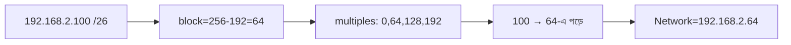
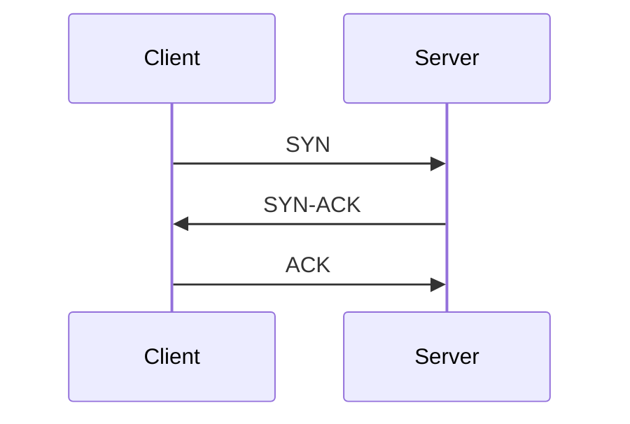

# 05 — Networking & Subnetting ⭐ · Deep-Dive (20 Questions)

> **Bilingual:** English question + terms, Bengali explanation। সহজ → senior stretch।
> Pairs with `../05-networking-subnetting.md`. **Subnetting verbatim এসেছে real WellDev test-এ — এটাই সবচেয়ে দামি topic।**

---

### ১. IPv4 address কী দিয়ে গঠিত?

**Description:** 32 bit = 4 octet, প্রতিটা 0–255।

**মনে রাখার পয়েন্ট:**
- উদাহরণ: `192.168.2.100` — চারটা octet।
- প্রতি octet 8 bit → মোট 32 bit।
- Mask address-কে network part + host part-এ ভাগ করে।

---

### ২. Subnet mask ও CIDR (/n) মানে কী?

**Description:** Mask-এর 1-bit = network, 0-bit = host। CIDR `/n` = network bit-এর সংখ্যা।

**মনে রাখার পয়েন্ট:**
- `/24` = 24 network bit = `255.255.255.0`।
- `/26` = `255.255.255.192`।
- বেশি `/n` → ছোট subnet, কম host।

---

### ৩. "Block size" method কী? (subnetting-এর মূল অস্ত্র)

**Description:** যে octet-এ mask 255 বা 0 নয়, সেখানে block size = 256 − mask value।

**মনে রাখার পয়েন্ট:**
| CIDR | Mask octet | Block size | Usable hosts |
|------|-----------|-----------|--------------|
| /24 | 0 | 256 | 254 |
| /25 | 128 | 128 | 126 |
| /26 | 192 | 64 | 62 |
| /27 | 224 | 32 | 30 |
| /28 | 240 | 16 | 14 |
| /30 | 252 | 4 | 2 |
- Block size = 2^(host bits)। Usable = block − 2।

---

### ৪. Network address কীভাবে বের করবে? (ধাপ)

**Description:** Block size বের করে IP-র octet-এর নিচের নিকটতম multiple।

**মনে রাখার পয়েন্ট:**
১. Mask-এর non-255/non-0 octet খুঁজো।
২. Block size = 256 − mask value।
৩. Network = block size-এর largest multiple ≤ IP octet।
৪. Broadcast = পরের multiple − 1।

---

### ৫. THE reported question: `192.168.2.100` /26 → network address?

**Description:** WellDev-এ verbatim এসেছে — cold জানো।

**মনে রাখার পয়েন্ট:**
- Mask 4th octet = 192 → block size = **64**।
- Multiples: 0, **64**, 128, 192 → 100 পড়ে 64–127-এ।
- **Network = `192.168.2.64`**, Broadcast = `192.168.2.127`।
- Host range = `.65` – `.126` (62 usable)।

---

### ৬. Broadcast address ও host range কীভাবে?

**Description:** Broadcast = block-এর শেষ address; host = তার মাঝেরগুলো।

**মনে রাখার পয়েন্ট:**
- Broadcast = পরের network − 1।
- First host = network + 1, last host = broadcast − 1।
- `192.168.2.64/26`: broadcast `.127`, host `.65`–`.126`।

---

### ৭. Usable hosts কেন block size − 2?

**Description:** দুটো address reserved — network ও broadcast।

**মনে রাখার পয়েন্ট:**
- Network address (প্রথম) ও broadcast (শেষ) host-কে দেওয়া যায় না।
- /30 = block 4 → usable মাত্র **2** (point-to-point link-এ perfect)।
- /26 = 64 − 2 = **62**।

---

### ৮. আরও subnet drill — `10.0.0.200` /27?

**Description:** /27 → block 32।

**মনে রাখার পয়েন্ট:**
- Multiples of 32: 0,32,...,192,224 → 200 পড়ে 192–223।
- Network `10.0.0.192`, broadcast `10.0.0.223`, host `.193`–`.222` (30 usable)।

---

### ৯. OSI 7-layer model — mnemonic সহ?

**Description:** নেটওয়ার্ক communication-এর ৭ স্তর।

**মনে রাখার পয়েন্ট:**
- *Please Do Not Throw Sausage Pizza Away* → Physical, Data-link, Network, Transport, Session, Presentation, Application।
- Layer 3 = Network (IP, router); Layer 2 = Data-link (MAC, switch)।
- Layer 4 = Transport (TCP/UDP, port)।

---

### ১০. OSI vs TCP/IP model?

**Description:** TCP/IP হলো practical 4-layer model।

**মনে রাখার পয়েন্ট:**
- TCP/IP: Application, Transport, Internet, Network Access।
- OSI 7 layer = তাত্ত্বিক reference; TCP/IP = বাস্তবে চলে।
- OSI Application+Presentation+Session ≈ TCP/IP Application।

---

### ১১. TCP vs UDP — পার্থক্য?

**Description:** দুই transport protocol।

**মনে রাখার পয়েন্ট:**
- **TCP**: reliable, ordered, ACK, 3-way handshake (web, email, file)।
- **UDP**: connectionless, fast, no guarantee (video, voice, gaming, DNS)।
- MCQ: "connectionless" → UDP; "reliable" → TCP।

---

### ১২. TCP 3-way handshake কী?

**Description:** Connection স্থাপনের তিন ধাপ।

**মনে রাখার পয়েন্ট:**
- SYN → SYN-ACK → ACK।
- Connection close = 4-way (FIN/ACK)।
- UDP-তে handshake নেই।

---

### ১৩. Common port numbers?

**Description:** MCQ-তে সরাসরি জিজ্ঞেস হয়।

**মনে রাখার পয়েন্ট:**
- FTP 20/21, SSH 22, Telnet 23, SMTP 25, DNS 53।
- HTTP 80, HTTPS 443, MySQL 3306।
- Well-known port 0–1023।

---

### ১৪. DNS কীভাবে কাজ করে?

**Description:** Domain name → IP address অনুবাদ।

**মনে রাখার পয়েন্ট:**
- Browser → DNS resolver → root → TLD → authoritative → IP ফেরত।
- বেশিরভাগ UDP 53 (fast), বড় transfer-এ TCP।
- Caching থাকে (TTL) — বারবার lookup এড়াতে।

---

### ১৫. HTTP request একটা URL টাইপ করলে কী ঘটে?

**Description:** End-to-end flow — interview classic।

**মনে রাখার পয়েন্ট:**
১. DNS resolve → IP।
২. TCP 3-way handshake (port 443)।
৩. TLS handshake (HTTPS encryption)।
৪. HTTP GET request → server response (status + body)।
৫. Browser render।

---

### ১৬. HTTP vs HTTPS?

**Description:** HTTPS = HTTP + TLS encryption।

**মনে রাখার পয়েন্ট:**
- HTTP port 80 (plain text), HTTPS port 443 (encrypted)।
- HTTPS: eavesdropping ও tampering থেকে রক্ষা।
- TLS certificate দিয়ে server identity verify।

---

### ১৭. Router vs Switch vs Hub?

**Description:** তিন networking device, ভিন্ন layer।

**মনে রাখার পয়েন্ট:**
- **Router**: layer 3, IP দিয়ে network-এর মধ্যে route।
- **Switch**: layer 2, MAC দিয়ে একই network-এ frame forward।
- **Hub**: layer 1, সবাইকে broadcast (পুরনো, dumb)।

---

### ১৮. Public vs Private IP + NAT?

**Description:** Private IP internal, NAT দিয়ে internet-এ যায়।

**মনে রাখার পয়েন্ট:**
- Private range: `10.x`, `172.16–31.x`, `192.168.x`।
- **NAT**: private IP → public IP অনুবাদ (router করে)।
- IPv4 exhaustion-এর কারণে NAT দরকার।

---

### ১৯. [Stretch] `172.16.5.10` /30 — সব বের করো?

**Description:** /30 point-to-point link।

**মনে রাখার পয়েন্ট:**
- Block = 256 − 252 = 4 → multiples 0,4,8,12।
- 10 পড়ে 8–11 → network `172.16.5.8`, broadcast `.11`।
- Usable: `.9`, `.10` (মাত্র 2 host) — router-to-router link-এ ব্যবহার।

---

### ২০. [Stretch] IPv4 vs IPv6 + subnet সংখ্যা হিসাব?

**Description:** IPv6 128-bit, বিশাল address space। আর একটা /24 কে /26-এ ভাঙলে কয়টা subnet?

**মনে রাখার পয়েন্ট:**
- IPv6 = 128 bit (IPv4 exhaustion-এর সমাধান), hex-এ লেখা।
- /24 → /26 borrow করে 2 bit → 2² = **4 subnet**, প্রতিটায় 62 host।
- Subnet সংখ্যা = 2^(borrowed bits); host = 2^(host bits) − 2।

---

## Quick self-check (এই ২০টা পারলে subnetting question জেতা)
১-৮: IP, mask, block size, network/broadcast/host, usable hosts, drills।
৯-১৮: OSI/TCP-IP, TCP vs UDP, handshake, ports, DNS, HTTP flow, HTTPS, devices, NAT।
১৯-২০: /30 drill, IPv6 + subnet count (stretch)।
