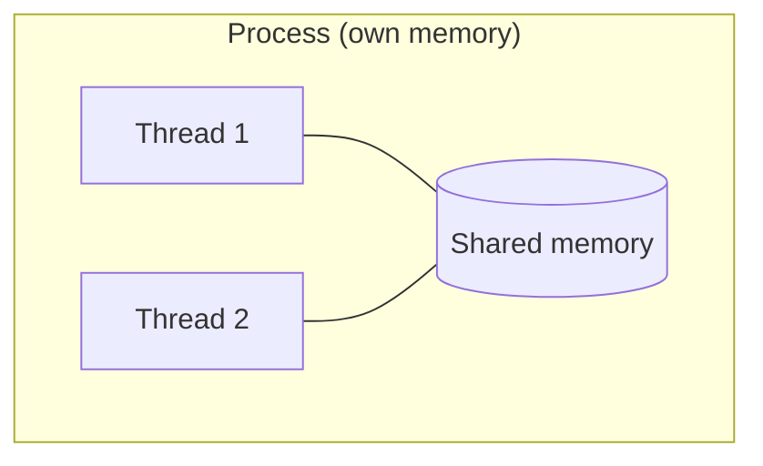
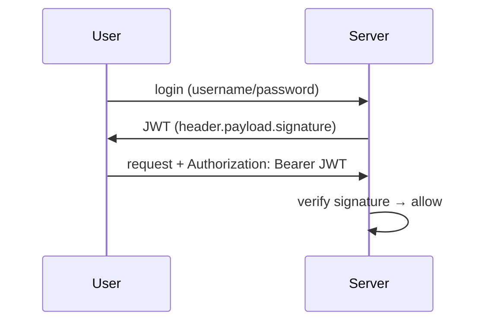

# 06 — Operating Systems + Web / API / JWT · Deep-Dive (20 Questions)

> **Bilingual:** English question + terms, Bengali explanation। সহজ → senior stretch।
> Pairs with `../06-os-web-api.md`. JWT flow ৩ বাক্যে বলতে পারা জরুরি।

---

### ১. Process vs Thread — পার্থক্য?

**Description:** Process-এর নিজের memory, thread process-এর memory share করে।

**মনে রাখার পয়েন্ট:**
- **Process**: আলাদা memory, heavy, IPC দিয়ে communicate।
- **Thread**: shared memory, light, দ্রুত communicate।
- Thread crash পুরো process ফেলে দিতে পারে; process isolated।

---

### ২. Process states কী কী?

**Description:** একটা process-এর জীবনচক্র।

**মনে রাখার পয়েন্ট:**
- `New → Ready → Running → Waiting → Terminated`।
- Running → Waiting: I/O-র জন্য অপেক্ষা।
- Ready: CPU পাওয়ার অপেক্ষায়।

---

### ৩. CPU scheduling algorithms?

**Description:** কোন process কখন CPU পাবে তা ঠিক করা।

**মনে রাখার পয়েন্ট:**
- **FCFS**: first come first served (convoy effect)।
- **SJF**: shortest job first (optimal avg wait, prediction দরকার)।
- **Round Robin**: time quantum, fair, time-sharing।
- **Priority**: উচ্চ priority আগে (starvation ঝুঁকি)।

---

### ৪. Deadlock কী এবং ৪ শর্ত?

**Description:** Process গুলো পরস্পরের resource-এর জন্য চিরকাল অপেক্ষা।

**মনে রাখার পয়েন্ট:**
- ৪ শর্ত (সব লাগে): **Mutual exclusion, Hold and wait, No preemption, Circular wait**।
- যেকোনো একটা ভাঙলে deadlock নেই।
- Handle: prevention, avoidance (Banker's), detection + recovery।

---

### ৫. Mutex vs Semaphore?

**Description:** দুই synchronization tool।

**মনে রাখার পয়েন্ট:**
- **Mutex**: একটাই owner (lock), binary, ownership আছে।
- **Semaphore**: counter, N resource allow, ownership নেই।
- Binary semaphore ≈ mutex কিন্তু signaling-এ ব্যবহার।

---

### ৬. Paging ও virtual memory কী?

**Description:** Memory-কে fixed-size page-এ ভাগ; disk-কে extra RAM হিসেবে ব্যবহার।

**মনে রাখার পয়েন্ট:**
- **Paging**: fixed-size page/frame → external fragmentation নেই।
- **Virtual memory**: RAM-এ না থাকলে disk থেকে আনে।
- **Page fault**: চাওয়া page RAM-এ নেই।
- **Thrashing**: অতিরিক্ত paging → performance ধস।

---

### ৭. Concurrency vs Parallelism?

**Description:** দুটো আলাদা ধারণা, প্রায়ই গুলিয়ে যায়।

**মনে রাখার পয়েন্ট:**
- **Concurrency**: একাধিক task সামলানো (interleaving, single core-এও)।
- **Parallelism**: একসাথে চালানো (multiple core দরকার)।
- এক লাইনে: "concurrency = dealing with many, parallelism = doing many"।

---

### ৮. REST কী এবং verb গুলো?

**Description:** Resource-based stateless API architecture।

**মনে রাখার পয়েন্ট:**
- **GET** read, **POST** create, **PUT** replace, **PATCH** partial update, **DELETE** remove।
- Idempotent: GET, PUT, DELETE (বারবার = একই ফল); POST নয়।
- Stateless: প্রতি request নিজের সব তথ্য বহন করে।

---

### ৯. HTTP status code গুলো?

**Description:** Response-এর ফলাফল জানায়।

**মনে রাখার পয়েন্ট:**
- 2xx success: 200 OK, 201 Created, 204 No Content।
- 3xx redirect: 301 Moved।
- 4xx client: 400 Bad Request, 401 Unauthorized, 403 Forbidden, 404 Not Found।
- 5xx server: 500 Internal Error, 503 Unavailable।

---

### ১০. 401 vs 403 — পার্থক্য? (classic trap)

**Description:** দুটোই "না", কিন্তু কারণ আলাদা।

**মনে রাখার পয়েন্ট:**
- **401 Unauthorized**: তুমি login করোনি (authentication নেই)।
- **403 Forbidden**: login করেছ কিন্তু permission নেই (authorization fail)।
- মনে রাখো: 401 = কে তুমি জানি না; 403 = জানি, কিন্তু allowed না।

---

### ১১. How does an API work? (৪ বাক্যে)

**Description:** Client-server request-response।

**মনে রাখার পয়েন্ট:**
১. Client HTTP request পাঠায় (verb + URL + header + body)।
২. Server route করে, logic চালায়, DB query করে।
৩. Server status code + JSON ফেরত দেয়।
৪. Stateless — প্রতি request নিজেই complete।

---

### ১২. JWT authentication — ৩ বাক্যে ব্যাখ্যা?

**Description:** Signed token দিয়ে stateless auth।

**মনে রাখার পয়েন্ট:**
১. Login-এ server credential verify করে **signed JWT** দেয়।
২. Client প্রতি request-এ `Authorization: Bearer <token>` পাঠায়।
৩. Server signature verify করে (DB lookup ছাড়া → stateless) payload পড়ে।

---

### ১৩. JWT-এর তিন অংশ কী?

**Description:** `header.payload.signature`।

**মনে রাখার পয়েন্ট:**
- **Header**: algorithm + type।
- **Payload**: claims (user id, role, exp) — **base64, encrypted নয়** → secret রেখো না।
- **Signature**: header+payload secret দিয়ে sign → tampering ধরে।
- MCQ trap: payload যে কেউ decode করতে পারে (শুধু encoded)।

---

### ১৪. Session vs Token (JWT) based auth?

**Description:** State কোথায় থাকে তার পার্থক্য।

**মনে রাখার পয়েন্ট:**
- **Session**: server-এ state রাখে, client শুধু session id (cookie)।
- **JWT**: stateless, token-এই সব তথ্য, server state রাখে না।
- JWT scale-friendly কিন্তু revoke করা কঠিন (expiry পর্যন্ত valid)।

---

### ১৫. Cookies vs LocalStorage — token কোথায়?

**Description:** Frontend-এ token রাখার জায়গা।

**মনে রাখার পয়েন্ট:**
- **HttpOnly cookie**: JS পড়তে পারে না → XSS-safe, কিন্তু CSRF ঝুঁকি।
- **LocalStorage**: JS access → XSS ঝুঁকি, CSRF নেই।
- Best practice: HttpOnly + Secure cookie বা careful handling।

---

### ১৬. CORS কী?

**Description:** Cross-Origin Resource Sharing — browser security policy।

**মনে রাখার পয়েন্ট:**
- এক origin-এর page অন্য origin-এ request করলে browser আটকায়।
- Server `Access-Control-Allow-Origin` header দিয়ে অনুমতি দেয়।
- Preflight `OPTIONS` request non-simple call-এ যায়।

---

### ১৭. HTML block vs inline element + box model?

**Description:** HTML/CSS basics MCQ।

**মনে রাখার পয়েন্ট:**
- **Block** (`
`, `
`): পুরো line নেয়, নতুন line-এ শুরু।
- **Inline** (``, `<a>`): শুধু content-এর সমান।
- **Box model**: content → padding → border → margin।
- CSS specificity: inline > id > class > element।

---

### ১৮. GET vs POST — নিরাপত্তা ও ব্যবহার?

**Description:** দুই সবচেয়ে common HTTP verb।

**মনে রাখার পয়েন্ট:**
- **GET**: data URL-এ (query string), cache/bookmark হয়, idempotent, sensitive data নয়।
- **POST**: data body-তে, cache হয় না, create-এ ব্যবহার।
- GET length-limited; POST বড় payload।

---

### ১৯. [Stretch] Rate limiting ও idempotency key কী?

**Description:** API-কে robust করার দুই কৌশল।

**মনে রাখার পয়েন্ট:**
- **Rate limiting**: নির্দিষ্ট সময়ে max request (429 Too Many Requests) — abuse রোধ।
- **Idempotency key**: একই request দুবার এলেও একবার process (double payment রোধ)।
- Retry-safe API design-এর অংশ।

---

### ২০. [Stretch] Context switch cost ও thread pool কেন?

**Description:** বেশি thread সবসময় দ্রুত নয়।

**মনে রাখার পয়েন্ট:**
- **Context switch**: CPU এক thread থেকে অন্যটায় গেলে state save/restore — খরচ আছে।
- অতিরিক্ত thread → বেশি context switch → ধীর।
- **Thread pool**: নির্দিষ্ট সংখ্যক thread reuse — creation cost ও switch কমায়।

---

## Quick self-check
১-৭: OS — process/thread, states, scheduling, deadlock, mutex/semaphore, paging, concurrency।
৮-১৮: Web — REST, status codes, 401/403, API flow, JWT (3 parts), session vs token, cookie storage, CORS, HTML, GET/POST।
১৯-২০: rate limiting/idempotency, context switch (stretch)।
