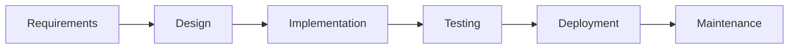

# 07 — SDLC + Security + Aptitude/Math · Deep-Dive (20 Questions)

> **Bilingual:** English question + terms, Bengali explanation। সহজ → senior stretch।
> Pairs with `../07-sdlc-security-aptitude.md`. SDLC order + auth vs authz cold।

---

### ১. SDLC-এর phase গুলো order-এ কী?

**Description:** Software তৈরির জীবনচক্র।

**মনে রাখার পয়েন্ট:**
- Requirements → Design → Implementation → Testing → Deployment → Maintenance।
- MCQ trap: শুরু **Requirements** দিয়ে, coding দিয়ে নয়।
- প্রতিটা phase-এর deliverable আছে।

---

### ২. Waterfall vs Agile?

**Description:** দুই development model।

**মনে রাখার পয়েন্ট:**
- **Waterfall**: sequential, rigid, requirement আগে fix (phase overlap নেই)।
- **Agile**: iterative sprint, adaptive, continuous feedback।
- Waterfall = requirement স্থির হলে; Agile = পরিবর্তনশীল হলে।

---

### ৩. Agile / Scrum-এর মূল ধারণা?

**Description:** Agile-এর সবচেয়ে জনপ্রিয় framework।

**মনে রাখার পয়েন্ট:**
- Sprint (2–4 সপ্তাহ), daily standup, product backlog, sprint review, retrospective।
- Roles: Product Owner, Scrum Master, Dev Team।
- Agile values: working software, customer collaboration, responding to change।

---

### ৪. Testing types কী কী?

**Description:** বিভিন্ন স্তরে test।

**মনে রাখার পয়েন্ট:**
- **Unit**: একক function/class।
- **Integration**: module একসাথে।
- **System**: পুরো app।
- **UAT**: user acceptance।
- **Regression**: পরিবর্তনের পর পুনরায় test।

---

### ৫. Black-box vs White-box testing?

**Description:** Code জানা vs না জানা।

**মনে রাখার পয়েন্ট:**
- **Black-box**: internal code না জেনে input-output test।
- **White-box**: code structure জেনে path/branch test।
- **Gray-box**: আংশিক জ্ঞান।

---

### ৬. Authentication vs Authorization?

**Description:** নিরাপত্তার দুই স্তম্ভ (classic MCQ)।

**মনে রাখার পয়েন্ট:**
- **Authentication (AuthN)**: তুমি কে? (login, password, OTP, JWT)।
- **Authorization (AuthZ)**: তুমি কী করতে পারবে? (role, permission)।
- AuthN আগে, AuthZ পরে।

---

### ৭. SQL Injection কী এবং প্রতিরোধ?

**Description:** Input দিয়ে malicious SQL চালানো।

**মনে রাখার পয়েন্ট:**
- উদাহরণ: `' OR '1'='1` দিয়ে auth bypass।
- প্রতিরোধ: **parameterized query / prepared statement**, ORM ব্যবহার।
- কখনো raw input concatenate করে query বানাবে না।

---

### ৮. XSS vs CSRF?

**Description:** দুই common web vulnerability।

**মনে রাখার পয়েন্ট:**
- **XSS**: page-এ malicious **JavaScript** inject → output escape/sanitize করো।
- **CSRF**: user-এর browser দিয়ে অনিচ্ছাকৃত request → **CSRF token** ব্যবহার।
- XSS = script injection; CSRF = forged request।

---

### ৯. Hashing vs Encryption?

**Description:** দুটোই data নিরাপদ করে, কিন্তু আলাদা।

**মনে রাখার পয়েন্ট:**
- **Hashing**: one-way (SHA-256, bcrypt) — password, integrity, reverse করা যায় না।
- **Encryption**: two-way — key দিয়ে decrypt সম্ভব।
- Password সবসময় hash (bcrypt + salt), encrypt নয়।

---

### ১০. Symmetric vs Asymmetric encryption?

**Description:** Key কীভাবে ব্যবহার হয়।

**মনে রাখার পয়েন্ট:**
- **Symmetric** (AES): একটাই key encrypt+decrypt, দ্রুত।
- **Asymmetric** (RSA): public key encrypt, private key decrypt।
- HTTPS: asymmetric দিয়ে key exchange, তারপর symmetric-এ data।

---

### ১১. HTTPS/TLS কীভাবে নিরাপত্তা দেয়?

**Description:** Transit-এ data encrypt।

**মনে রাখার পয়েন্ট:**
- HTTPS = HTTP + TLS।
- TLS handshake-এ certificate দিয়ে server verify + session key তৈরি।
- Man-in-the-middle ও eavesdropping রোধ।

---

### ১২. Percentage ও percentage change — formula?

**Description:** Aptitude-এর মূল।

**মনে রাখার পয়েন্ট:**
- x% of y = (x/100) × y। যেমন 20% of 150 = **30**।
- Increase a→b = ((b−a)/a) × 100%।
- Successive % change ভুল করো না (গুণ করে হিসাব)।

---

### ১৩. Ratio ও proportion?

**Description:** N-কে a:b অনুপাতে ভাগ।

**মনে রাখার পয়েন্ট:**
- a:b split of N → a·N/(a+b) এবং b·N/(a+b)।
- উদাহরণ: 300 কে 2:3 → 120 আর 180।
- Proportion: a/b = c/d → ad = bc (cross multiply)।

---

### ১৪. Average, speed, simple interest — formula?

**Description:** Common aptitude formula।

**মনে রাখার পয়েন্ট:**
- Average = sum / count।
- Speed = distance / time।
- Simple interest = P·R·T / 100।
- দুটো average মেলালে weighted average লাগে।

---

### ১৫. Number series pattern চেনা?

**Description:** পরের সংখ্যা বের করা।

**মনে রাখার পয়েন্ট:**
- Arithmetic: constant diff (2,5,8,11 → +3)।
- Geometric: constant ratio (3,6,12,24 → ×2)।
- Squares/cubes: 1,4,9,16 (n²); 1,8,27 (n³)।
- Fibonacci: আগের দুটোর যোগ।

---

### ১৬. Logical reasoning puzzle — কৌশল?

**Description:** Time-pressured logic question।

**মনে রাখার পয়েন্ট:**
- Grid/table এঁকে "who-sits-where" সমাধান।
- **Two-pass**: কঠিন puzzle skip, পরে ফিরে।
- Wording ফাঁদ: NOT / EXCEPT / only / always।

---

### ১৭. Version control (Git) basics — MCQ-তে আসে?

**Description:** SDLC/tooling-এর অংশ।

**মনে রাখার পয়েন্ট:**
- **Merge** vs **Rebase**: merge history রাখে (merge commit), rebase linear করে।
- **Pull request**: review + merge workflow।
- `commit`, `branch`, `push`, `pull` — daily flow।

---

### ১৮. CI/CD কী?

**Description:** Automated build/test/deploy।

**মনে রাখার পয়েন্ট:**
- **CI** (Continuous Integration): প্রতি push-এ auto build + test।
- **CD** (Continuous Delivery/Deployment): auto release।
- লাভ: দ্রুত feedback, কম manual error।

---

### ১৯. [Stretch] OWASP Top 10 থেকে আর কী জানা দরকার?

**Description:** Common security risk সচেতনতা।

**মনে রাখার পয়েন্ট:**
- Broken access control, injection, broken auth, security misconfiguration, sensitive data exposure।
- Password: bcrypt hash + salt; MFA যোগ।
- Least privilege principle — যতটুকু দরকার ততটুকুই permission।

---

### ২০. [Stretch] Waterfall কখন Agile-এর চেয়ে ভালো?

**Description:** Model বাছাইয়ের trade-off।

**মনে রাখার পয়েন্ট:**
- Waterfall ভালো: requirement স্থির, regulatory/safety-critical, fixed scope+budget।
- Agile ভালো: পরিবর্তনশীল requirement, দ্রুত delivery, feedback loop।
- Interview line: "model requirement-এর certainty-র ওপর নির্ভর করে বেছে নিই"।

---

## Quick self-check
১-৫: SDLC, Waterfall/Agile, Scrum, testing types, black/white-box।
৬-১১: AuthN/AuthZ, SQL injection, XSS/CSRF, hashing/encryption, symmetric/asymmetric, HTTPS।
১২-১৮: %, ratio, formulas, series, logic, Git, CI/CD।
১৯-২০: OWASP, model trade-off (stretch)।
