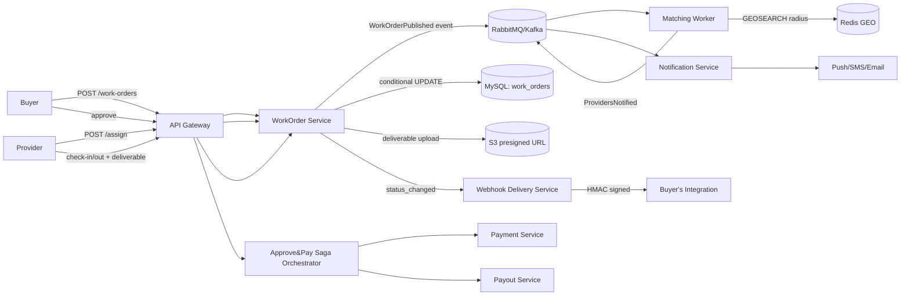

> Tracker ID: FN-14 · Generated: 2026-09-28 · Source: `00-research/backend-system-design-study-plan.md` (Phase 11 framework + Phase 12 Case 1), `_memory/story-bank.md`

# System Design: Field Nation Work-Order Dispatch

**সময়সীমা:** ~৩৫ মিনিট, জোরে বলে প্র্যাকটিস করো (Day 11)। কাঠামো নিচের ৭-ধাপ ফ্রেমওয়ার্ক অনুযায়ী — প্রতিটা ইন্টারভিউ ডিজাইনে এই একই অর্ডার ব্যবহার করো।

---

## ১. Clarify Requirements (~৫ মিনিট)

**Functional:**
- Buyer একটা Work Order (WO) পোস্ট করে: scope, location, schedule, pay, deliverables।
- সিস্টেম qualified provider-দের কাছে WO রুট/ডিসপ্যাচ করে (skill, distance, rating, availability দিয়ে)।
- Provider accept করে, site-এ check-in/check-out করে (GPS + timestamp), deliverable (photo/signature) আপলোড করে।
- Buyer কাজ approve করে → payment trigger হয় → provider payout হয়।
- দুই পক্ষ একে অপরকে rating দেয়।
- Buyer-এর ticketing system REST API + webhook দিয়ে integrate করতে পারে।

**Non-functional:**
- **Consistency:** একটা WO ঠিক একজন provider-কে assign হবে (race condition handle করতে হবে) — strong consistency দরকার এখানে।
- **Availability:** WO browsing/matching high-availability, কিন্তু payment-এর মতো জায়গায় consistency-কে availability-র উপরে রাখা হয় (money-এর ক্ষেত্রে ভুল সহ্য হয় না)।
- **Latency:** matching + notify কয়েক সেকেন্ডের মধ্যে হওয়া উচিত (provider দ্রুত জানতে চায়)।
- **Scale:** নিচে estimate করা হচ্ছে।

**যা জিজ্ঞেস করব ইন্টারভিউয়ারকে:** geo-radius কত? real-time bidding না কি push-then-first-accept-wins? payment এই ডিজাইনের স্কোপে আছে কি না?

🔗 Sokrio link: multi-tenant approval workflow-এর কনসিস্টেন্সি চিন্তা S3-এর মতোই (tenant isolation strong consistency দাবি করে)।

---

## ২. Estimate (~৩ মিনিট)

- ৫০k WO/day, peak US morning hours হলে ধরি ৩× peak factor → ~150k WO equivalent load ঘণ্টায় concentrated।
- ২০০k active provider, প্রতিটার লোকেশন আপডেট হয় (heartbeat বা check-in সময়ে)।
- QPS (WO creation) ≈ 50,000 / 86,400 ≈ 0.6 req/s গড়ে, কিন্তু বিশাল burst পিক আওয়ারে — matching/notification সিস্টেমকে burst absorb করতে হবে (queue দিয়ে)।
- Storage: প্রতি WO-তে metadata + deliverable photo (S3-তে, DB-তে শুধু URL/reference) — DB row ছোট থাকে, ভারী object storage-এ যায়।

---

## ৩. API Design (~৫ মিনিট)

```
POST   /v1/work-orders                     — buyer creates WO (idempotency-key header required)
GET    /v1/work-orders?status=&cursor=     — cursor pagination, filter by status/buyer
POST   /v1/work-orders/{id}/publish        — Draft → Published
POST   /v1/work-orders/{id}/assign         — conditional assign (accept race handled here)
POST   /v1/work-orders/{id}/check-in       — GPS + timestamp
POST   /v1/work-orders/{id}/check-out      — GPS + timestamp + deliverables
POST   /v1/work-orders/{id}/approve        — buyer approves → triggers payment saga
POST   /v1/work-orders/{id}/rate           — buyer↔provider rating
Webhook: workorder.status_changed          — HMAC-signed, retried with backoff
```

- সব POST-এ idempotency key (client retry হলে duplicate WO/assign না হয়)।
- Cursor pagination, offset না (10M+ row-এ offset স্লো)।
- Auth: buyer/provider আলাদা scope-এর JWT বা API key (integration client-দের জন্য)।

---

## ৪. Data Model (~৫ মিনিট)

```
Buyer(id, name, ...)
Provider(id, name, skills[], rating, current_location(lat,lng), last_seen_at)
WorkOrder(id, buyer_id, status, scope, location(lat,lng), scheduled_at, pay_amount, version)
Assignment(id, work_order_id, provider_id, assigned_at, status)
CheckIn(id, assignment_id, type[in|out], lat, lng, recorded_at, is_mock_location)
Deliverable(id, assignment_id, file_url, uploaded_at)
Payment(id, work_order_id, amount, status, idempotency_key)
Rating(id, work_order_id, from_id, to_id, score, comment)
```

- `WorkOrder.status`: state machine — `Draft → Published → Routed → Assigned → Confirmed → Checked-in → Checked-out → Work Done → Approved → Paid` (+ `Cancelled`, `On Hold`, `Problem Reported`)। Invalid transition → `409`।
- `WorkOrder.version` কলাম — optimistic locking-এর জন্য (নিচে দেখো)।

---

## ৫. High-Level Design (~১০ মিনিট)



**মূল কম্পোনেন্ট:**
- **WorkOrder Service** — core state machine, MySQL-এ সোর্স অফ ট্রুথ।
- **Matching Worker** — WO published হলে event পায়, Redis GEO দিয়ে ৫০ কিমি-র মধ্যে qualified provider খুঁজে বের করে, rank করে (skill/rating/distance/fairness — সবসময় একই provider-কে ping না করা)।
- **Notification Service** — fan-out per channel (push/SMS/email), retry+DLQ।
- **Webhook Delivery Service** — outbox pattern, exponential backoff, N বার fail হলে disable + replay UI।

---

## ৬. Deep Dive (~১০ মিনিট)

### Deep dive ১ — Accept Race Condition
একই মিলিসেকেন্ডে দুই provider "Accept" চাপলে একজনই জিতবে। তিনটা সমাধান:

1. **Conditional update (সবচেয়ে সহজ, recommended):**
   ```sql
   UPDATE work_orders
   SET provider_id = ?, status = 'assigned'
   WHERE id = ? AND status = 'published';
   -- affected_rows == 1 হলে জিতেছি, 0 হলে হেরেছি
   ```
2. **`SELECT ... FOR UPDATE`** — transaction-এর ভেতর row lock নিয়ে চেক করে আপডেট (pessimistic, বেশি লক ওভারহেড)।
3. **Version column (optimistic):** `UPDATE ... WHERE id=? AND version=?` — mismatch হলে retry/reject।

Trade-off বলব: conditional update সবচেয়ে কম লক কনটেনশন দেয়, high-concurrency accept-এর জন্য এটাই প্রথম পছন্দ।

### Deep dive ২ — Technician Matching / Geo-Routing
- Redis GEO (`GEOADD`/`GEOSEARCH`) দিয়ে provider-দের lat/lng ইনডেক্স করা, radius query O(log N + M)।
- Filter chain: skill match → distance radius → rating threshold → blocked-list বাদ → fairness (weighted random বা round-robin যাতে সবসময় একই top-provider-কে ping না হয়)।
- Precompute vs on-demand: hot region-এ provider list cache করা যায় short TTL দিয়ে।

### Deep dive ৩ — Approve → Pay Saga
```
Buyer approves WO
 → PaymentService: buyer charge / prepaid deduct
 → PayoutService: schedule provider payout
 → WorkOrderService: status = Paid
 ✗ payout fail হলে → compensate: refund/hold + status = Payment Issue + alert
```
Choreography (প্রতিটা সার্ভিস event শুনে পরের কাজ করে) এখানে ভালো ফিট, কারণ ধাপ কম আর orchestrator একটা single point of failure এড়ানো যায়।

---

## ৭. Bottlenecks & Trade-offs (~৫ মিনিট)

- **Hot region overload:** একটা শহরে হঠাৎ অনেক WO পাবলিশ হলে matching worker bottleneck — horizontal scale matching workers, partition by region।
- **Webhook storm:** buyer-এর সিস্টেম ধীর হলে retry backlog — DLQ + circuit breaker + per-client rate limit।
- **MySQL write hot-spot:** সব accept একই `work_orders` টেবিলে যায় — composite index (`buyer_id, status, scheduled_at`), short transactions, consistent lock order deadlock এড়াতে।
- **Consistency vs availability:** payment path-এ strong consistency বেছে নিয়েছি (ভুল পেমেন্টের চেয়ে সামান্য ধীর ভালো); matching/browsing path-এ eventual consistency যথেষ্ট।
- **Failure mode:** matching worker down থাকলে WO published অবস্থায় আটকে থাকবে — health check + auto-restart + alert on queue depth (SLI/SLO থেকে — FN-13 দেখো)।

---

## Sokrio-এ যা সরাসরি করেছি vs এখানে নতুন

| অংশ | Sokrio-তে লাইভ অভিজ্ঞতা | নতুন/স্টাডি-করা |
|---|---|---|
| Event-driven service split, RabbitMQ, zero-downtime cutover | ✅ S1 | — |
| Heavy read optimisation, index/EXPLAIN, caching | ✅ S2 | — |
| Strong consistency for tenant-scoped writes | ✅ S3 (concept parallel) | — |
| Webhook HMAC + idempotency, reconciliation | ✅ S5 | — |
| GPS check-in/spoofing detection concept | ✅ S9 | — |
| Redis GEO / geohash radius search at 200k-provider scale | ❌ | নতুন — সরাসরি এই স্কেলে geo-routing করিনি, স্টাডি করে ডিজাইন বলছি |
| Saga orchestration as a named pattern (choreography vs orchestration) | ❌ (concept-এ কাছাকাছি কাজ করেছি, নাম করে ডিজাইন করিনি) | নতুন — pattern-এর ভাষায় নতুন, বাস্তবায়ন ধারণা পুরনো |
