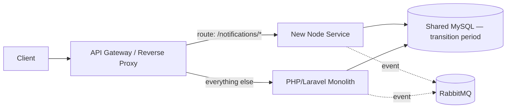

> Tracker ID: FN-15 · Generated: 2026-09-28 · Source: `00-research/backend-system-design-study-plan.md` (Phase 7 — Microservices Architecture), `_memory/story-bank.md` S1

# System Design: PHP → Node Migration (Strangler Fig)

**সময়সীমা:** ~৩৫ মিনিট, জোরে বলে প্র্যাকটিস (Day 12)। Field Nation-এর জব পোস্ট বলছে "increasingly transitioning to Node.js microservices" — এরা ঠিক এই মাইগ্রেশনের মাঝখানে আছে, আর Komol-এর এটাই সবচেয়ে শক্তিশালী স্টোরি (S1)।

---

## ১. লিড করো লাইভ অভিজ্ঞতা দিয়ে (S1)

> **Say it (EN):** "I led the move from a Laravel/Vue monolith to a core API plus separate Report, Notification and SOP services talking over RabbitMQ. We ran old and new in parallel and cut over with zero downtime. Server load dropped by about 20%."

**সৎ নোট:** Sokrio-র মাইগ্রেশন PHP→Node ছিল না — এটা ছিল **monolith → modular services**, সবই Laravel/PHP-এর মধ্যে, ভাষা বদলায়নি। যেটা সরাসরি প্রমাণ করে: service boundary কাটা, parallel run, zero-downtime cutover, event-driven decoupling (RabbitMQ)। যেটা নতুন এখানে: দুই ভিন্ন ভাষার (PHP ↔ Node) মধ্যে interop আর data-type/serialization সমস্যা — এটা ইন্টারভিউয়ারকে সততার সাথে বলা উচিত, তারপর ডিজাইনে এক্সটেন্ড করা।

---

## ২. Strangler Fig Pattern — কেন এবং কীভাবে

**কেন "big bang rewrite" না:** পুরো সিস্টেম একসাথে রিরাইট করলে মাসের পর মাস কোনো নতুন ফিচার শিপ হয় না, আর একদিনে সব বদলালে রোলব্যাক প্রায় অসম্ভব। Strangler fig ধীরে ধীরে, প্রোডাকশনে থেকেই, ছোট ছোট অংশ সরায়।

**ধাপ:**
1. একটা proxy/gateway বসাও যেটা route অনুযায়ী ট্র্যাফিক PHP বা Node-এ পাঠায়।
2. **সবচেয়ে কম-ঝুঁকির bounded context দিয়ে শুরু করো** — যেমন Notifications (read-heavy, side-effect-only, ভুল হলে ইউজার শুধু একটা push মিস করে, টাকা হারায় না)। Payment বা core WO assignment দিয়ে শুরু করা ভুল — ব্লাস্ট রেডিয়াস বড়।
3. Node service সেই ডোমেইনের জন্য নতুন এন্ডপয়েন্ট বানায়, প্রথমে **শুধু PHP-র ডেটা পড়ে** (shared DB বা read replica থেকে), তারপর ধীরে ধীরে write ownership নেয়।
4. Proxy-তে ওই route-এর % ট্র্যাফিক ধীরে ধীরে বাড়াও (5% → 50% → 100%), মেট্রিক দেখে দেখে (error rate, latency)।
5. পুরনো PHP কোড ডিলিট করো, পরের bounded context ধরো।

---

## ৩. Database-per-Service সমস্যা (Transition Period)

সাময়িকভাবে PHP আর Node দুটোই একই MySQL ছোঁয় — এটা ইচ্ছাকৃতভাবে অস্থায়ী, কারণ:
- দুই সার্ভিস একই টেবিলে schema migration করলে coupling ভাঙে না, শুধু ভাষা বদলায়।
- **সমাধান:** Node service নিজের টেবিল/schema-র মালিক হয়ে যায় ধাপে ধাপে; PHP সেই ডেটা দরকার হলে Node-এর API কল করে, সরাসরি টেবিল না ছুঁয়ে। শেষ পর্যন্ত "database per service" এ পৌঁছাই।
- **Dual-write ঝুঁকি:** transition-এ যদি দুই সার্ভিস একই ডেটা দুই জায়গায় লেখে, sync ভাঙতে পারে — তাই **PHP বা Node, একজনই writer**, অন্যজন শুধু event/API দিয়ে জানে (S1-এর "parallel run" আসলে এই প্যাটার্নের কাছাকাছি — old ও new দুটোই চলেছিল কিন্তু cutover-এর সময় স্পষ্টভাবে ownership সুইচ হয়েছে)।

---

## ৪. Contract Testing (Old ↔ New)

- **Pact**-এর মতো consumer-driven contract test: PHP (consumer) যে shape আশা করে Node API-র রেসপন্সে, সেটা টেস্ট স্যুটে লক করা থাকে — Node সাইড কিছু বদলালে সাথে সাথে ব্রেক ধরা পড়ে।
- Shadow traffic / dark launch: নতুন Node endpoint-এ প্রোডাকশন ট্র্যাফিকের একটা কপি পাঠানো (response ব্যবহার না করে) — output PHP-র সাথে মিলিয়ে দেখা, রিয়েল ইউজারকে না জানিয়ে।

## ৫. Rollback Strategy

- Proxy-র route % **feature-flag-এর মতো** — কোনো এক route-এ সমস্যা দেখলে সেকেন্ডে ১০০% ট্র্যাফিক PHP-তে ফিরিয়ে দাও।
- Node service স্টেটলেস রাখো যাতে রোলব্যাকে ডেটা ইনকনসিস্টেন্সি না হয় — অথবা যদি write করেই ফেলে, একটা reconciliation/backfill script রেডি রাখো।
- প্রতিটা extraction-এর আগে একটা "কী ভুল হতে পারে" চেকলিস্ট আর rollback রানবুক লিখে রাখা — deploy-এর পরে না ভাবা।

---

## ৬. এক্সট্র্যাকশনের অর্ডার (উদাহরণ)

| ধাপ | Bounded Context | কেন এই অর্ডার |
|---|---|---|
| ১ | Notifications | Read-heavy, side-effect-only, কম ঝুঁকি |
| ২ | Reporting/Analytics | মূলত read, ভুল হলে ইউজার-ফেসিং কোনো ব্লকার হয় না |
| ৩ | Webhooks/Integrations | External contract স্পষ্ট, isolate করা সহজ |
| ৪ | Work Order core | সবচেয়ে বেশি লজিক + concurrency (accept race), তাই সবার শেষে — ততদিনে টিমের Node experience পাকা |
| ৫ | Payments | সর্বোচ্চ ঝুঁকি, সবচেয়ে শেষে, সবচেয়ে বেশি টেস্ট কভারেজ দাবি করে |

---

## ৭. কী ভুল হয়েছিল / কী অন্যভাবে করতাম

`[Komol পূরণ করবে — S1-এর আসল মাইগ্রেশনে কোনো নির্দিষ্ট সমস্যা হয়েছিল কি? যেমন: কোনো সার্ভিস বাউন্ডারি ভুল কেটেছিলে পরে রিফ্যাক্টর করতে হয়েছে, বা RabbitMQ message ordering-এ কোনো bug ধরা পড়েছিল, বা parallel-run period কতদিন ছিল এবং সেটা যদি ছোট/বড় করতে চাইতে]`

ইন্টারভিউয়ে এই সেকশন **অবশ্যই থাকা উচিত** — "what went wrong" প্রশ্ন প্রায় সবসময় আসে, আর ফাঁকা রাখলে ভুল সংখ্যা বানানোর চেয়ে ভালো "এখনো ঠিক করে মনে নেই, কিন্তু generally এই ধরনের সমস্যা হয়" বলে সাধারণ প্যাটার্নে (deep dive S1-এ Defend লাইন দেখো) উত্তর দেওয়া।

---

## Sokrio-এ যা সরাসরি করেছি vs এখানে নতুন

| অংশ | Sokrio-তে লাইভ অভিজ্ঞতা | নতুন/স্টাডি-করা |
|---|---|---|
| Monolith → services split, RabbitMQ decoupling | ✅ S1 | — |
| Parallel run + zero-downtime cutover | ✅ S1 | — |
| **ভাষা বদল (PHP → Node)**, interop/serialization issue | ❌ | নতুন — Sokrio-র মাইগ্রেশন same-language ছিল |
| Formal strangler-fig proxy/gateway pattern (named) | ⚠️ আংশিক (concept একই, নাম করে করিনি) | নতুন ভাষায় বলা |
| Contract testing (Pact) between old/new | ❌ | নতুন — স্টাডি-করা, বাস্তবে ব্যবহার করিনি |
